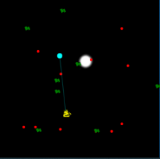
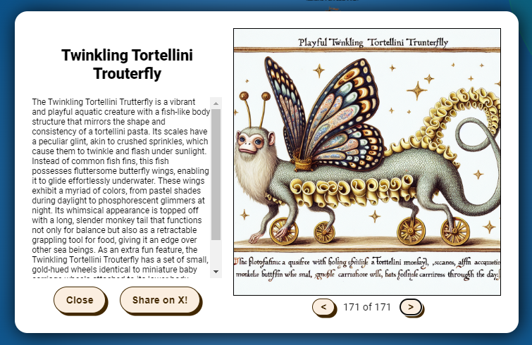

# Bonus - Fishing

## Objective

Fishing objective!

!!! question "Request"
    Catch twenty different species of fish that live around Geese Islands. When you're done, report your findings to Poinsettia McMittens on the Island of Misfit Toys.

??? quote "Poinsettia McMittens"
    Excuse me, but you're interrupting my fishing serenity. Oh, you'd like to know how to become as good at fishing as I am?<br/>
    Well, first of all, thank you for noticing my flair for fishing. It's not just about looking good beside the lake, you know.

??? tip "Become the Fish"
    Perhaps there are some clues about the local aquatic life located in the HTML source code.

??? tip "Fishing Machine"
    There are a variety of strategies for automating repetative website tasks. Tools such as AutoKey and AutoIt allow you to programmatically examine elements on the screen and emulate user inputs.


## Solution
In source code we have found interesting link, which will be required to catch some rare fishes:
```
<!-- <a href='fishdensityref.html'>[DEV ONLY] Fish Density Reference</a> -->
```

First we started inspecting source code and console tools.

We can see requests sent to this WS endpoint: wss://2023.holidayhackchallenge.com/sail?dockSlip=4606a58c-ccff-4bbf-b9c7-66bcba107161

After inspecing WS communication we can see interesting messages whenever we catch a fish.

```json
e:{"65139":{"uid":65139,"username":"LS1942","x":790.122627300308,"y":1669.9187716418694,"o":1,"vx":0,"vy":0,"config":{"colors":["plaid","black","blue"],"progress":[false,false,false,true,true,true]},"fishCaught":[{"name":"JellyChip CuddleSwimmer","description":"<-- removed -->","hash":"f71ba29843c1d46325da6e8ec821896b"}],"bearing":"spi-coggogglemarina","canFish":true,"ports":["ci-rudolphsrest","imt-squarewheelyard","imt-scaredykiteheights","imt-tarnishedtrove","spi-coggogglemarina","spi-brassbouyport","pi-rainrastercliffs","si-spaceportpoint","staging","fni-theblacklightdistrict","ci-frostysbeach","spi-rustyquay"],"showOthers":true,"keyState":0,"colors":["plaid","black","blue"],"progress":[false,false,false,true,true,true],"fishing":true,"onTheLine":"The Speckled Pizzafin Fizzflyer"}}
```

We need to make sure to properly decode those json messages and monitor onTheLine value whenever received.

To catch most rare fish (Piscis Cyberneticus Skodo) we used heatmap located under https://2023.holidayhackchallenge.com/sea/fishdensityref.html . TO make use of it the best we overrided JS script with custom one. img src="assets/noise/Piscis Cyberneticus Skodo.png"

```js hl_lines="13"

    const ImageAssets = {
    ship: 'assets/ship.png',
    rod: 'assets/rod.png',
    roddown: 'assets/roddown.png',
    bobber: 'assets/bobber.png',
    shipclip: 'assets/shipclip.png',
    blocks: 'assets/blocks.png',
    ocean: 'assets/ocean.png',
    detail: 'assets/island_detail.png',
    buoy: 'assets/buoy.png',
    wave: 'assets/wave.png',
    bump: 'assets/bump.png',
    minimap: 'assets/minimap.png',
    miniboat: 'assets/miniboat.png',
    shadow: 'assets/shadow.png',
    startflag: 'assets/startflag.png',
    finishflag: 'assets/finishflag.png',
    arrow: 'assets/arrow.png',
};

```

This is exact place where we need to hunt for our rare specie. Heat map black colour mean you won't be able to hunt fish so we need to go white spot.

{ width="500" }


Below we can see JS script for TamperMonkey extension. Mainly i was using ChatGPT to develop it.


```JS
// ==UserScript==
// @name         WebSocket Hook Script with Selective JSON Processing
// @namespace    http://tampermonkey.net/
// @version      1.0
// @description  Hook into existing WebSocket connections, selectively process JSON messages
// @author       Your Name
// @match        https://2023.holidayhackchallenge.com/*
// @grant        none
// @run-at       document-start
// ==/UserScript==

(function() {
    'use strict';

    var OriginalWebSocket = window.WebSocket;
    var webSockets = [];

var reelSent = false;
var caughtFishList = [];

function searchOnTheLine(obj) {
    for (var key in obj) {
        if (typeof obj[key] === 'object') {
            // If the current value is an object, recursively search it
            searchOnTheLine(obj[key]);
        } else if (key === 'onTheLine') {
            // If the key is 'onTheLine', check its value
            if (obj[key] !== false) {
                console.log(obj[key]);
                // If the value is not false, send a "cast" message
                sendMessage('reel');
                reelSent = true;

                // Set a timeout to send "cast" 5 seconds after sending "reel"
                setTimeout(function () {
                    if (reelSent) {
                        sendMessage('cast');

                    }
                }, 5000);
            }
        } else if (key === 'fishCaught') {
            // If the key is 'fishCaught', handle it using a separate function
            handleFishCaught(obj[key]);
        }
    }
}

function handleFishCaught(fishCaughtData) {
    caughtFishList.push(fishCaughtData); // Add the caught fish to the list
    console.log(fishCaughtData);
    // You can perform additional processing or checks here as needed
}

window.WebSocket = function(url, protocols) {
    var ws = protocols ? new OriginalWebSocket(url, protocols) : new OriginalWebSocket(url);
    webSockets.push(ws);

    ws.addEventListener('message', function(event) {
        // Check if the message might be valid JSON (e.g., starts with '{' after removing two characters)
        if (event.data.slice(2).trim().startsWith('{')) {
            try {
                // Remove the first two characters and parse the rest as JSON
                var jsonData = JSON.parse(event.data.slice(2))

                // Search for "onTheLine" anywhere in the JSON structure
                searchOnTheLine(jsonData);

            } catch (e) {
                console.error('Error processing JSON message:', e);
            }
        } else {
            // If not JSON, you can log or ignore these messages
        }
    });

    return ws;
};
    for (var prop in OriginalWebSocket) {
        if (OriginalWebSocket.hasOwnProperty(prop)) {
            window.WebSocket[prop] = OriginalWebSocket[prop];
        }
    }

    function sendMessage(message) {
        if (webSockets.length > 0 && webSockets[0].readyState === WebSocket.OPEN) {
            webSockets[0].send(message);
        } else {
            console.error('No active WebSocket connection found.');
        }
    }

    setTimeout(function() {
        sendMessage('cast');
    }, 5000);

})();
```

And here we go with our final fish!



!!! success "Answer"
    Catched 171 Fish species.