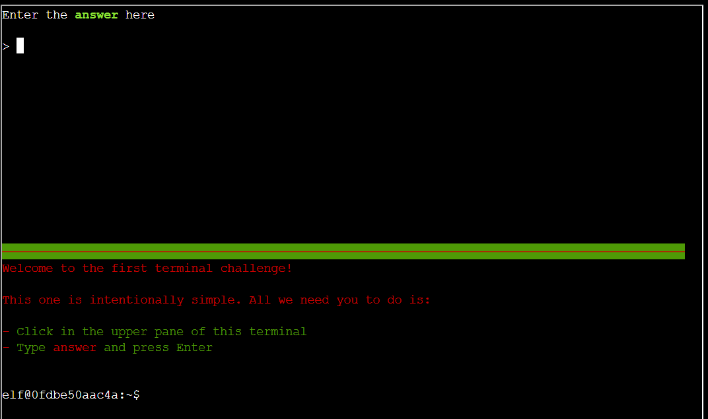

# Holiday Hack Orientation

**Difficulty**: :fontawesome-solid-star::fontawesome-regular-star::fontawesome-regular-star::fontawesome-regular-star::fontawesome-regular-star: 
**Direct link**: [Objective terminal](https://hhc23-wetty.holidayhackchallenge.com/)

## Objective

!!! question "Request"
    Talk to Jingle Ringford on Christmas Island and get your bearings at Geese Islands

??? quote "Jingle Ringford"
    Welcome to the Geese Islands and the 2023 SANS Holiday Hack Challenge! 
    I'm Jingle Ringford, one of Santa's many elves. 
    Santa asked me to meet you here and give you a short orientation to this festive event. 
    Before you head back to your boat, I'll ask you to accomplish a few simple tasks. 

## Solution

For this task, the requirement was to input the correct answer into the terminal to proceed.

{ width="500" }

!!! success "Answer"
    answer

## Response

!!! quote "Jingle Ringford"
    Perfect! Your orientation is now complete! 
    Head back to your boat or click on the anchor icon on the left of the screen to set sail for Frosty's Beach where Santa's waiting for you. I've updated your boat's compass to guide the way. 
    As you sail to each island, talk to the goose of that island to receive a colorful lei festooning the masts on your ship. 
    Safe travels my friend and remember, relax, enjoy the sun, and most importantly, have FUN!
