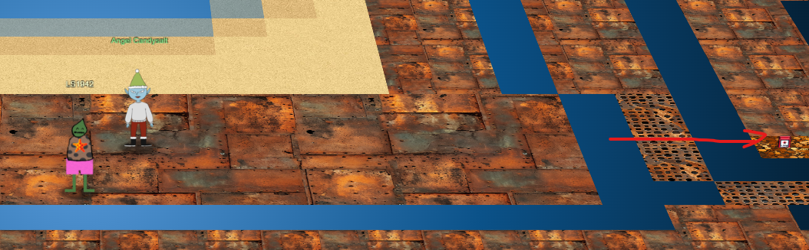
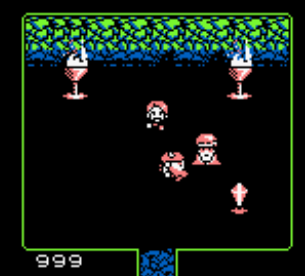
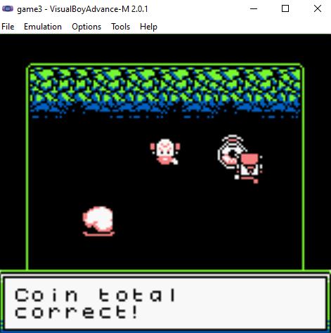
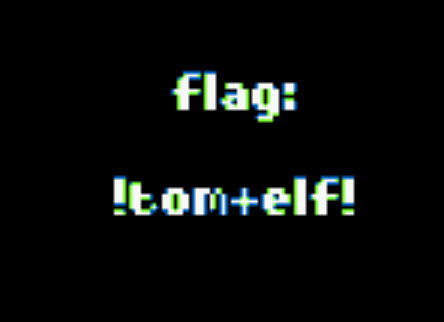

# Insert Game Cartridges: Vol 3

**Difficulty**: :fontawesome-solid-star::fontawesome-solid-star::fontawesome-solid-star::fontawesome-regular-star::fontawesome-regular-star:<br/>
**Direct link**: [Objective Terminal](https://gamegosling.com/vol3-7bNwQKGBFNGQT1/index.html)

## Objective

!!! question "Request"
    Insert the objective description from your badge.

??? quote "Angel Candysalt"
    Copy the first part of the conversation with Elf Name here<br/>
    You can use `<br/>` to ensure each sentence starts on a new line.

## Hints

??? tip "Gameboy 3"
    1) This one is a bit long, it never hurts to save your progress! 2) 8bit systems have much smaller registers than you’re used to. 3) Isn’t this great?!? The coins are OVERFLOWing in their abundance.


## Solution

Place where we can find Cartridge vol 3.



First of all we need to download GameBoy ROM to emulate it locally. This can be found using Network tab in Chrome.
```
https://gamegosling.com/vol3-7bNwQKGBFNGQT1/rom/game.gb
```

For this challange we selected GameBoyAdvance emulator to save progress of the game and easily create saves which we are going to investigate.

We are going to check what is format of the save. We can see .sav extension and recommendation from ChatGPT to check it using Hex Editor.


Once we restored save we were able to gain 999 coins which were required to complete game.



Total amount of coins is correct:



Success! We got the flag:



!!! success "Answer"
    Insert the answer to the objective here.

## Response

!!! quote "Angel Candysalt"
    Copy the final part of the conversation with Elf Name here.
