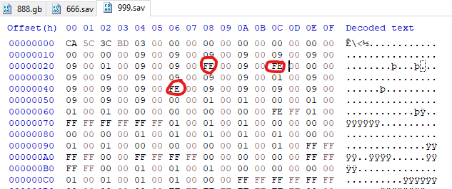

# Game Cartridges: Vol 3

**Difficulty**: :fontawesome-solid-star::fontawesome-solid-star::fontawesome-solid-star::fontawesome-regular-star::fontawesome-regular-star:<br/>
**Direct link**: [Objective Terminal](https://gamegosling.com/vol3-7bNwQKGBFNGQT1/index.html)

## Objective

!!! question "Request"
    Find the third Gamegosling cartridge and beat the game

??? quote "Angel Candysalt"
    The life of a treasure hunter isn't easy, but it sure is exciting!<br/>
    Oh it's a video game, I love video games! But you've claimed this treasure, nicely done.<br/>
    Now, about those secrets I've been told. They're pretty cryptic, but they are. Hopefully that helps with something!<br/>

## Hints

??? tip "Gameboy 3"
    1) This one is a bit long, it never hurts to save your progress! 2) 8bit systems have much smaller registers than you’re used to. 3) Isn’t this great?!? The coins are OVERFLOWing in their abundance.


## Solution

Place where we can find Cartridge vol 3.


First of all we need to download GameBoy ROM to emulate it locally. This can be found using Network tab in Chrome.
```
https://gamegosling.com/vol3-7bNwQKGBFNGQT1/rom/game.gb
```

For this challange we selected GameBoyAdvance emulator to save progress of the game and easily create saves which we are going to investigate.

We are going to check what is format of the save. We can see .sav extension and recommendation from ChatGPT to check it using Hex Editor.

I have generated few saves with different amount of coins( ex 666 , 555, 888). Thanks to this move i was able to spot offset with data which we modify.



Once we restored save we were able to gain 999 coins which were required to complete game.


Total amount of coins is correct:


Success! We got the flag:


!!! success "Answer"
    !tom+elf!

## Response

!!! quote "Angel Candysalt"
    You have all three? Wow, you must be the greatest treasure hunter that ever lived!
