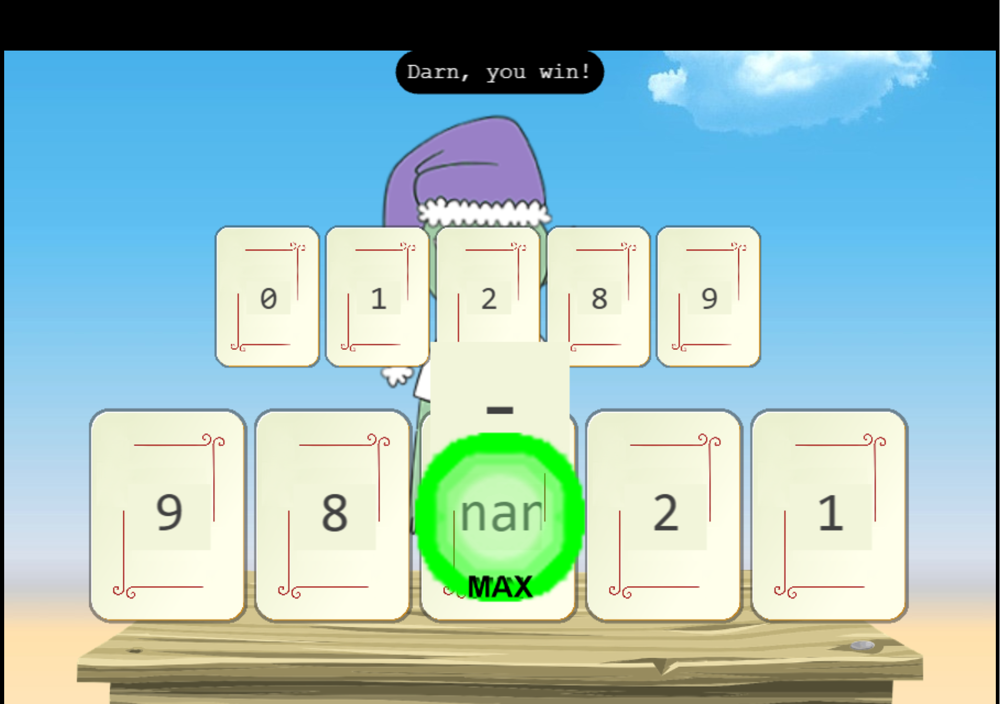

# Na'an

**Difficulty**: :fontawesome-solid-star::fontawesome-solid-star::fontawesome-regular-star::fontawesome-regular-star::fontawesome-regular-star: 
**Direct link**: [Objective6.zip](https://nannannannannannan.com/?&challenge=naan)

## Objective

!!! question "Request"
    Shifty McShuffles is hustling cards on Film Noir Island. Outwit that meddling elf and win!

??? quote "Shifty McShuffles"
    Copy the first part of the conversation with Elf Name here
    Hey there, stranger! Fancy a game of cards? Luck's on your side today, I can feel it. 
    Step right up, test your wit! These cards could be your ticket to fortune. 
    Trust me, I've got a good eye for winners, and you've got the look of luck about you. 
    Plus, I'd wager you've never played this game before, as this isn't any ordinary deck of cards. It's made with Python. 
    The name of the game is to bamboozle the dealer. 
    So whad'ya think? Are you clever enough? 

## Hints

??? tip "Stump the Chump"
    Try to outsmart Shifty by sending him an error he may not understand.

??? tip "The Upper Hand"
    Shifty said his deck of cards is made with Python. Surely there's a weakness to give you the upper hand in his game.

## Solution

First we found information application is written in Python.

{ width="500" }

After inserting NAN value into the middle card we confused game and won!

{ width="500" }

https://discuss.python.org/t/nan-breaks-min-max-and-sorting-functions-a-solution/2868

!!! success "Answer"
    Insert the answer to the objective here.

## Response

!!! quote "Shifty McShuffles"
    Well, you sure are more clever than most of the tourists that show up here.
