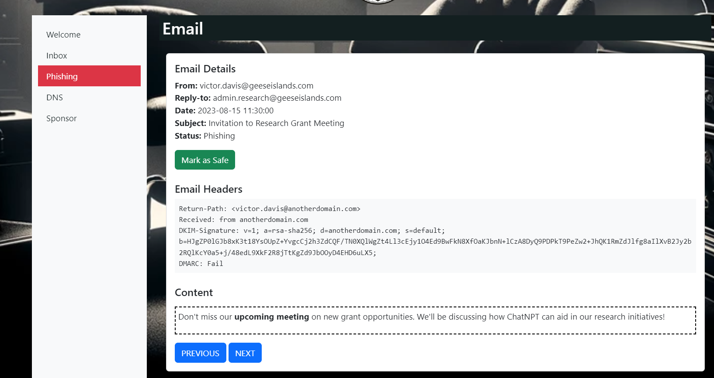
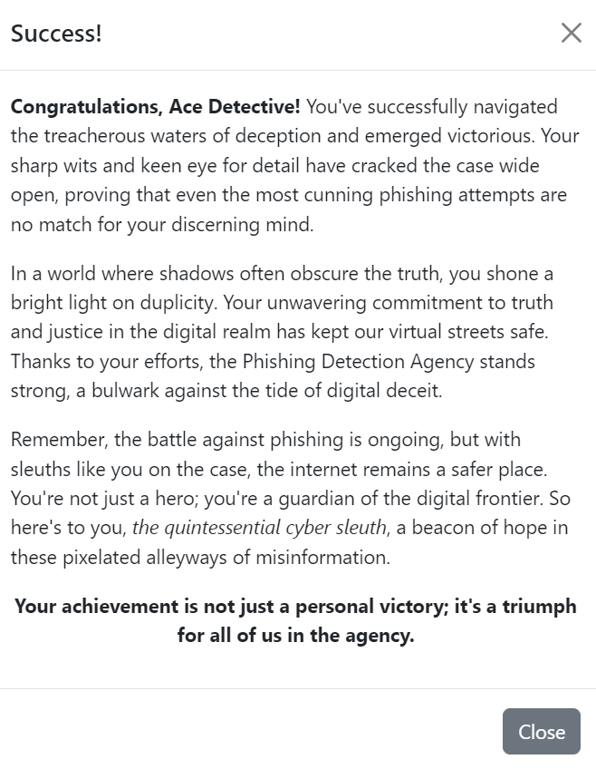
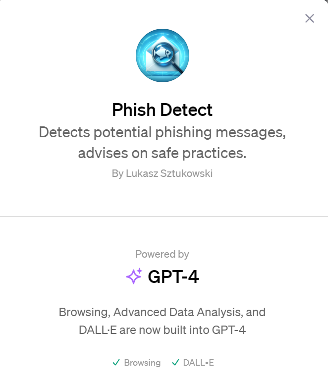

# Phish Detection Agency

**Difficulty**: :fontawesome-solid-star::fontawesome-solid-star::fontawesome-regular-star::fontawesome-regular-star::fontawesome-regular-star:<br/>
**Direct link**: [Objective URL](https://hhc23-phishdetect-dot-holidayhack2023.ue.r.appspot.com/?&challenge=phishdetect)

## Objective

!!! question "Request"
    Fitzy Shortstack on Film Noir Island needs help battling dastardly phishers. Help sort the good from the bad!

??? quote "Fitzy Shortstack"
    Just my luck, I thought...<br/>
    A cybersecurity incident right in the middle of this stakeout.<br/>
    Seems we have a flood of unusual emails coming in through ChatNPT.<br/>
    Got a nagging suspicion it isn't catching all the fishy ones.<br/>
    You're our phishing specialist right? Could use your expertise in looking through the output of ChatNPT.<br/>
    Not suggesting a full-blown forensic analysis, just mark the ones screaming digital fraud.<br/>
    We're looking at all this raw data, but sometimes, it takes a keen human eye to separate the chaff, doesn't it?<br/>
    I need to get more powdered sugar for my donuts, so do ping me when you have something concrete on this.<br/>

## Hints

??? tip "DMARC, DKIM, and SPF, oh my!"
    Discover the essentials of email security with DMARC, DKIM, and SPF at Cloudflare's Guide.<br/>
    https://www.cloudflare.com/learning/email-security/dmarc-dkim-spf/


## Solution

In this objective we are requested to find all mails which are potentialy suspicious. For this purpose we will explore DMARC, DKIM and SPF authentication methods.



!!! note "Cloudflare explanation"
    DMARC, DKIM, and SPF are three email authentication methods. Together, they help prevent spammers, phishers, and other unauthorized parties from sending emails on behalf of a domain* they do not own.<br/>
    DKIM and SPF can be compared to a business license or a doctor's medical degree displayed on the wall of an office — they help demonstrate legitimacy.
    Meanwhile, DMARC tells mail servers what to do when DKIM or SPF fail, whether that is marking the failing emails as "spam," delivering the emails anyway, or dropping the emails altogether.<br/>
    Domains that have not set up SPF, DKIM, and DMARC correctly may find that their emails get quarantined as spam, or are not delivered to their recipients. They are also in danger of having spammers impersonate them.<br/>

During the analysis of in BURP Suite, we identified the specific method utilized for sending requests to the website.

```
POST /check-status HTTP/2
Host: hhc23-phishdetect-dot-holidayhack2023.ue.r.appspot.com

["victor.davis@geeseislands.com","jason.brown@geeseislands.com","wendy.mitchell@geeseislands.com","steven.clark@geeseislands.com","harry.potter@geeseislands.com","john.doe@geeseislands.com","uma.foster@geeseislands.com","steven.gray@geeseislands.com","patricia.johnson@geeseislands.com","laura.green@geeseislands.com","grace.lee@geeseislands.com","nancy@geeseislands.com","victor.harris@geeseislands.com","rachel.brown@geeseislands.com","karen.evans@geeseislands.com","ursula.morris@geeseislands.com","quincy.adams@geeseislands.com","isabella.martin@geeseislands.com","oliver.hill@geeseislands.com","nancy.wilson@geeseislands.com","michael.roberts@geeseislands.com","alice.smith@geeseislands.com","frank.harrison@geeseislands.com","xavier.edwards@geeseislands.com","oliver.thomas@geeseislands.com","emily.white@geeseislands.com","teresa.green@geeseislands.com"]
```

and RESPONSE:

```sh
HTTP/2 400 Bad Request
Content-Type: application/json

{
    "message":"Lists do not match"
}
```

Let's try to review the list.

Once we found all Phishing mails, final POST message was as below:

```json
["victor.davis@geeseislands.com","xavier.jones@geeseislands.com","steven.gray@geeseislands.com","laura.green@geeseislands.com","nancy@geeseislands.com","rachel.brown@geeseislands.com","ursula.morris@geeseislands.com","quincy.adams@geeseislands.com","michael.roberts@geeseislands.com","oliver.thomas@geeseislands.com"]
```

And web server response:

```
HTTP/2 200 OK
Content-Type: application/json
{"hash":"2460331dfcc0f7015994861bb4f5e46846ffc8f65da32f360937082373948d8a","resourceId":"ad424a52-1fcc-45dc-81e5-8f40aa33551b"}
```


!!! success "Answer"
    ```json
    ["victor.davis@geeseislands.com","xavier.jones@geeseislands.com","steven.gray@geeseislands.com","laura.green@geeseislands.com","nancy@geeseislands.com","rachel.brown@geeseislands.com","ursula.morris@geeseislands.com","quincy.adams@geeseislands.com","michael.roberts@geeseislands.com","oliver.thomas@geeseislands.com"]
    ```

## 2nd Alternative

!!! note "ChatGPT code"
I have also tried to leverage chatGPT to develop python script to bruteforce answer, but after 1000 requests i give up.

```JS
import requests
import itertools
import time

# Define your list of email addresses
email_addresses = ["david.jones@geeseislands.com","victor.davis@geeseislands.com","laura.moore@geeseislands.com","quentin.adams@geeseislands.com"]
# URL and headers for the POST request
url = "https://hhc23-phishdetect-dot-holidayhack2023.ue.r.appspot.com/check-status"
headers = {
    "Content-Type": "application/json",
    "Host": "hhc23-phishdetect-dot-holidayhack2023.ue.r.appspot.com"
}
cookies = {
    "CaseFile": "eyJ1c2VyaWQiOiIyMGFjYTQxNy02YzU4LTRjMDctOGJlZC0yZGIzNDdjMThhYzcifQ.ZYISBg.q7sm93Whv-a2MAJIxFfZkZ88fvI"
}

# Initialize the POST request counter
post_request_count = 0

# Generate combinations of email addresses
for i in range(len(email_addresses)):
    for combination in itertools.combinations(email_addresses, i):
        # Convert the combination to a JSON list
        json_data = list(combination)

        # Make the POST request
        response = requests.post(url, json=json_data, headers=headers, cookies=cookies)
        post_request_count += 1
        # Print the response (or handle it as needed)
        print(f"Combination: {json_data}, Response: {response.status_code}, Body: {response.text}")
        time.sleep(1)
        print(f"Number of requests: {post_request_count}")
        # Add any additional logic or error handling as needed
print(f"Total number of POST requests made: {post_request_count}")
```
## ChatGPT Alternative

Alternative solution using ChatGPT App "Phish Detect":



!!! note "ChatGPT Mail 1 - Clean"
    Overall, while the email appears legitimate based on the information provided, it's important to remain cautious. If you have any doubts about the authenticity of the email, you can take additional steps such as directly contacting the sender through known official channels or checking with your IT department. Remember, it's always better to be safe and verify, especially if any personal or sensitive information is involved.

!!! note "ChatGPT Mail 2 - Phishing"
    Due to the mismatch between the sender's apparent domain and the actual domain of origin, combined with the failed DMARC authentication, this email is likely a phishing attempt. It's important not to respond to or click any links in this email. Instead, report it to your organization's IT department or the appropriate authority. Always verify the legitimacy of such emails through direct, official channels before taking any further action.

??? note " ChatGPT Mail 2 - Full Response"
    This email has several warning signs that are commonly associated with phishing attempts:

    1. **Mismatched Email Addresses**: The sender's address is `victor.davis@geeseislands.com`, but the return-path and the domain in the DKIM signature are from `anotherdomain.com`. This discrepancy is a major red flag, as it suggests that the email is not actually from the `geeseislands.com` domain it claims to be from.

    2. **DMARC Status**: The DMARC status is 'Fail'. This means that the email did not pass the domain's authentication checks, which is a strong indicator that it might be a phishing attempt.

    3. **Reply-To Address**: The reply-to address `admin.research@geeseislands.com` belongs to the `geeseislands.com` domain, but given the other discrepancies, this could be a tactic to make the email seem more legitimate.

    4. **Content of the Email**: While the content itself does not contain obvious phishing indicators such as urgent requests for personal information or suspicious links, the context, given the email discrepancies, should be approached with caution.

    Due to the mismatch between the sender's apparent domain and the actual domain of origin, combined with the failed DMARC authentication, this email is likely a phishing attempt. It's important not to respond to or click any links in this email. Instead, report it to your organization's IT department or the appropriate authority. Always verify the legitimacy of such emails through direct, official channels before taking any further action.


## Response

!!! quote "Fitzy Shortstack"
    You've cracked the case! Once again, you've proven yourself to be an invaluable asset in our fight against these digital foes.
