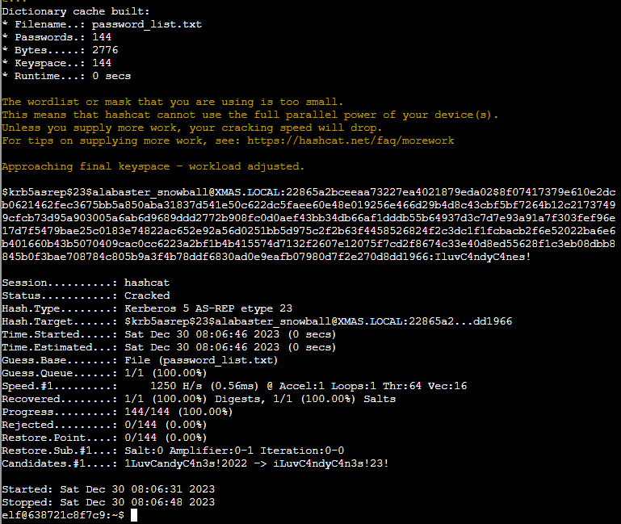
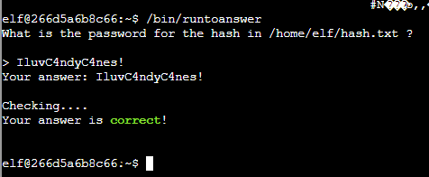

# Hashcat

**Difficulty**: :fontawesome-solid-star::fontawesome-solid-star::fontawesome-regular-star::fontawesome-regular-star::fontawesome-regular-star:<br/>
**Direct link**: [Objective URL](https://hhc23-wetty.holidayhackchallenge.com/?&challenge=hashcat)

## Objective

!!! question "Request"
    Eve Snowshoes is trying to recover a password. Head to the Island of Misfit Toys and take a crack at it!Insert the objective description from your badge.

??? quote "Eve Snowshoes"
    I'm Eve Snowshoes, resident tech hobbyist, and I hear Alabaster is in quite the predicament.<br/>
    Our dear Alabaster forgot his password. He's been racking his jingle bells of memory with no luck.<br/>
    I've been trying to handle this password recovery thing parallel to this hashcat business myself but it seems like I am missing some tricks.<br/>
    So, what do you say, chief, ready to get your hands on some hashcat action and help a distraught elf out?


## Hints

??? tip "Insert Hint 1 Title"
    Along the way you will receive different hints. Insert them here.

??? tip "Insert Hint 2 Title"
    Along the way you will receive different hints. Insert them here.

## Solution

We have been given access to Terminal where all files can be found under working directory:
```bash
elf@638721c8f7c9:~$ ls
HELP  hash.txt  password_list.txt
elf@638721c8f7c9:~$
elf@638721c8f7c9:~$ cat hash.txt 
$krb5asrep$23$alabaster_snowball@XMAS.LOCAL:22865a2bceeaa73227ea4021879eda02$8f07417379e610e2dcb0621462fec3675bb5a850aba31837d541e50c622dc5faee60e48e019256e466d29b4d8c43cbf5bf7264b12c21737499cfcb73d95a903005a6ab6d9689ddd2772b908fc0d0aef43bb34db66af1dddb55b64937d3c7d7e93a91a7f303fef96e17d7f5479bae25c0183e74822ac652e92a56d0251bb5d975c2f2b63f4458526824f2c3dc1f1fcbacb2f6e52022ba6e6b401660b43b5070409cac0cc6223a2bf1b4b415574d7132f2607e12075f7cd2f8674c33e40d8ed55628f1c3eb08dbb8845b0f3bae708784c805b9a3f4b78ddf6830ad0e9eafb07980d7f2e270d8dd1966elf@638721c8f7c9:~$
```
* Determine the hash type in hash.txt and perform a wordlist cracking attempt to find which password is correct and submit it to /bin/runtoanswer .*

Looking at help we determined hashtype and run command:
  18200 | Kerberos 5 AS-REP etype 23                       | Network Protocols

```bash
hashcat -w 1 -u 1 --kernel-accel 1 --kernel-loops 1 -m 18200 hash.txt password_list.txt --force
```

And this was final output:




INFO: All hashes found in potfile! Use --show to display them.

```bash
elf@266d5a6b8c66:~$ hashcat -w 1 -u 1 --kernel-accel 1 --kernel-loops 1 -m 18200 hash.txt password_list.txt --force --show
$krb5asrep$23$alabaster_snowball@XMAS.LOCAL:22865a2bceeaa73227ea4021879eda02$8f07417379e610e2dcb0621462fec3675bb5a850aba31837d541e50c622dc5faee60e48e019256e466d29b4d8c43cbf5bf7264b12c21737499cfcb73d95a903005a6ab6d9689ddd2772b908fc0d0aef43bb34db66af1dddb55b64937d3c7d7e93a91a7f303fef96e17d7f5479bae25c0183e74822ac652e92a56d0251bb5d975c2f2b63f4458526824f2c3dc1f1fcbacb2f6e52022ba6e6b401660b43b5070409cac0cc6223a2bf1b4b415574d7132f2607e12075f7cd2f8674c33e40d8ed55628f1c3eb08dbb8845b0f3bae708784c805b9a3f4b78ddf6830ad0e9eafb07980d7f2e270d8dd1966:**IluvC4ndyC4nes!**
```




!!! success "Answer"
    IluvC4ndyC4nes!


## Response

!!! quote "Eve Snowshoes"
    Aha! Success! Alabaster will undoubtedly be grateful for our assistance.
