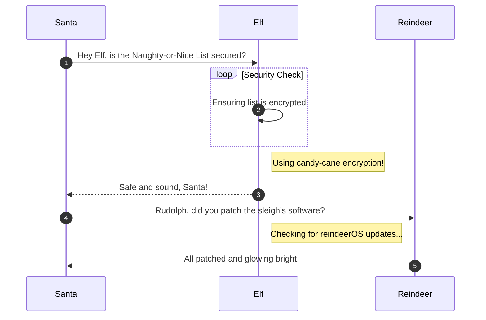

# Certificate SSHenanigans

**Difficulty**: :fontawesome-solid-star::fontawesome-solid-star::fontawesome-solid-star::fontawesome-solid-star::fontawesome-solid-star:<br/>
**Direct link**: [Objective URL](https://northpole-ssh-certs-fa.azurewebsites.net/api/create-cert?code=candy-cane-twirl)

## Objective

!!! question "Request"
    Go to Pixel Island and review Alabaster Snowball's new SSH certificate configuration and Azure Function App. What type of cookie cache is Alabaster planning to implement?

??? quote "Alabaster Snowball"
    I could use your help with my fancy new Azure server at ssh-server-vm.santaworkshopgeeseislands.org.<br/>
    ChatNPT suggested I upgrade the host to use SSH certificates, such a great idea!<br/>
    It even generated ready-to-deploy code for an Azure Function App so elves can request their own certificates. What a timesaver!<br/>
    I'm a little wary though. I'd appreciate it if you could take a peek and confirm everything's secure before I deploy this<br/>configuration to all the Geese Islands servers.<br/>
    Generate yourself a certificate and use the monitor account to access the host. See if you can grab my TODO list.<br/>
    If you haven't heard of SSH certificates, Thomas Bouve gave an introductory talk and demo on that topic recently.<br/>
    Oh, and if you need to peek at the Function App code, there's a handy Azure REST API endpoint which will give you details about how the Function App is deployed.<br/>

## Hints

??? tip "SSH Certificates Talk"
    Check out Thomas Bouve's talk and demo to learn all about how you can upgrade your SSH server configuration to leverage SSH certificates.

??? tip "Azure Function App Source Code"
    The get-source-control Azure REST API endpoint provides details about where an Azure Web App or Function App is deployed from.<BR/>
    https://learn.microsoft.com/en-us/rest/api/appservice/web-apps/get-source-control?view=rest-appservice-2022-03-01

## Solution

This section explains the different steps taken to solve the challenge. Try to find a good balance between providing sufficient detail and not overloading the reader with too much information. Use [admonitions](https://squidfunk.github.io/mkdocs-material/reference/admonitions/), [images](https://squidfunk.github.io/mkdocs-material/reference/images/), [diagrams](https://squidfunk.github.io/mkdocs-material/reference/diagrams/), [code blocks](https://squidfunk.github.io/mkdocs-material/reference/code-blocks/), and [tables](https://squidfunk.github.io/mkdocs-material/reference/data-tables/) to highlight and structure important information or provide additional clarification.

### Admonitions

!!! warning "Anchor the decorations"
    Ensure that all festive decorations, especially electrical ones, are securely anchored. We don’t want them floating off into the tropical sunset!

!!! info "Palm tree lighting"
    While on the island, make sure to hang your Christmas lights on a palm tree. It’s not only festive but also a great beacon for Santa to find you!

### Images


### Diagrams



### Code blocks

```bash linenums="1" hl_lines="7" title="Countdown script (with line 7 highlighted)"
#!/bin/bash
echo "Christmas Holiday Countdown"

days_until_xmas=$(($(date -d "Dec 25" +%j) - $(date +%j)))

if [ $days_until_xmas -ge 0 ]; then
  echo "Only $days_until_xmas days until Christmas!"
else
  echo "Christmas has passed! Hope you had a great time!"
fi
```

### Tables

| Activity             | Santa's Verdict       | Elf Comments                    |
| :------------------- | :-------------------- | :------------------------------ |
| Iceberg Surfing      | Risky Business        | "Lost three surfboards!"        |
| Polar Bear Hugs      | Approach with Caution | "Fluffy but... brisk."          |
| Snow Fort Building   | Highly Recommended    | "Elf-sized doorways only."      |
| Aurora Light Chasing | Magical Experience    | "Better than Christmas lights!" |
| Penguin Parade       | Absolute Must-See     | "They're oddly organized!"      |

!!! success "Answer"
    Insert the answer to the objective here.

## Response

!!! quote "Alabaster Snowball"
    Oh my! I was so focused on the SSH configuration I completely missed the vulnerability in the Azure Function App.<br/>
    Why would ChatNPT generate code with such a glaring vulnerability? It's almost like it wanted my system to be unsafe. Could ChatNPT be evil?<br/>
    Thanks for the help, I'll go and update the application code immediately!<br/>
    While we're on the topic of certificates, did you know Active Directory (AD) uses them as well? Apparently the service used to manage them can have misconfigurations too.<br/>
    You might be wondering about that SatTrackr tool I've installed on the monitor account?<br/>
    Here's the thing, on my nightly stargazing adventures I started noticing the same satellite above Geese Islands.<br/>
    I wrote that satellite tracker tool to collect some additional data and sure enough, it's in a geostationary orbit above us.<br/>
    No idea what that means yet, but I'm keeping a close eye on that thing!
