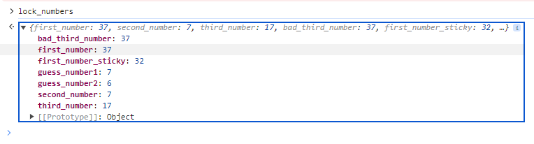

# Faster Lock Combination

**Difficulty**: :fontawesome-solid-star::fontawesome-solid-star::fontawesome-solid-star::fontawesome-solid-star::fontawesome-solid-star:<br/>
**Direct link**: [Objective Website](https://paddlelockdecode.com/)

## Objective

!!! question "Request"
    Over on Steampunk Island, Bow Ninecandle is having trouble opening a padlock. Do some research and see if you can help open it!

??? quote "Bow Ninecandle"
    Hey there! I'm Bow Ninecandle, and I've got a bit of a... 'pressing' situation.<br/>
    You can use `<br/>` to ensure each sentence starts on a new line.

## Hints

??? tip "Faster Lock tutorial"
    https://www.youtube.com/watch?v=27rE5ZvWLU0&ab_channel=HelpfulLockPicker


## Solution

We have received hint to check talk on faster lock !

{ width="500" }

First we are looking for sticky number and later two guess numbers. These numbers will help us determine final combination.

Step 1 we need to find Sticky number manipulating dial and putting little tension on a shackle. We need to keep moving clockwise untill dial stops on a number.

Step 2 Next we need to find 2 guess numbers which will lie between 0 and 11. The number is going to sit between the middle of two halh numbers.

Once we got all numbers we need to calculate our unclocking numbers, for this we use website: https://samy.pl/master/master.html

{ width="500" }

Once we have all numbers we need to try all of them to find the right combination.

Standard instructions for combination lock:
1. Turn right three times. Stop at First Digit.
2. Turn left one full turn passing 1st number and stop at Second Digit.
3. Turn right and stop at Third Digit. Pull shackle. Profit.

![Unlocked(../img/objectives/o17/unlocked.png)

We could also just look into console for those numbers, helpfull to see if we are rotating numbers properly:
    
    ```
    var first_set = false
    var first_passed = false
    var degrees_traversed = 0
    var second_set = false
    var third_set = false
    ```

{ width="500" }

## Response

!!! quote "Bow Ninecandle"
    Oh, thank heavens! You're a lifesaver! With your knack for cracking codes, we've just turned a potential 'loo catastrophe' into a holiday triumph!
