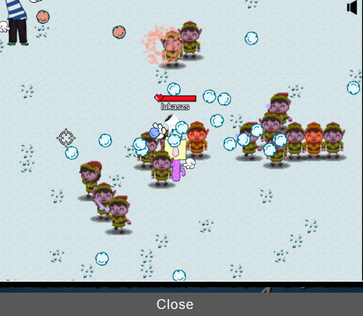
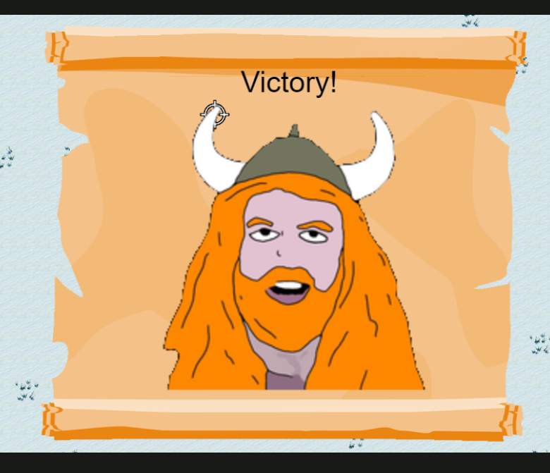

# Snowball Fight

**Difficulty**: :fontawesome-solid-star::fontawesome-solid-star::fontawesome-regular-star::fontawesome-regular-star::fontawesome-regular-star:<br/>
**Direct link**: [Objective 2 website](https://hhc23-snowball.holidayhackchallenge.com/)

## Objective

!!! question "Request"
    Visit Christmas Island and talk to Morcel Nougat about this great new game. Team up with another player and show Morcel how to win against Santa!

??? quote "Morcel Nougat"
    Hey there, I'm Morcel Nougat, elf extraordinaire!<br/>
    You won't believe this, but we're on a magical tropical island called Christmas Island, and it even has snow!</br>
    I'm so glad ChatNPT suggested we come here this year!


## Solution

First of all started interacting with web application to analyze underlying technologies. We quickly discover that we are interacting with JS. 

!!! info "ChatGPT"
    The DOM is an object-oriented representation of the web page, which can be modified with a scripting language like JavaScript. Each element in an HTML document is represented as a node in the DOM tree. This tree structure allows developers to access and manipulate HTML elements in a hierarchical manner.

Secondly we inspected frame where game was loaded. Looking into different elemenets we discovered window.player node. Manipulating window.player.body.height I was able to make model so tinny and it was unbetable. On top of that we also found  window.playersHitBoxSize which was also providing similar results. To aid speed of throwwing snowballes we make use of :  window.player.throwDelay=1.

## Hints

??? tip "Snowball Super Hero"
    Its easiest to grab a friend play with and beat Santa but tinkering with client-side variables can grant you all kinds of snowball fight super powers. You could even take on Santa and the elves solo!

??? tip "Consoling iFrames"
    Have an iframe in your document? Be sure to select the right context before meddling with JavaScript.<br>
    https://gist.github.com/chrisjd20/93771da596ca5e49043f148a845c469f


### Images

{ width="500" }

{ width="500" }

### Code blocks

```
window.player.body.height=1
window.player.throwDelay=1 
```


!!! success "Answer"
    window.player.body.height=1

## Response

!!! quote "Morcel Nougat"
    You're like a snowball fighting ninja! A real-life legend. Can I have your autograph!?


