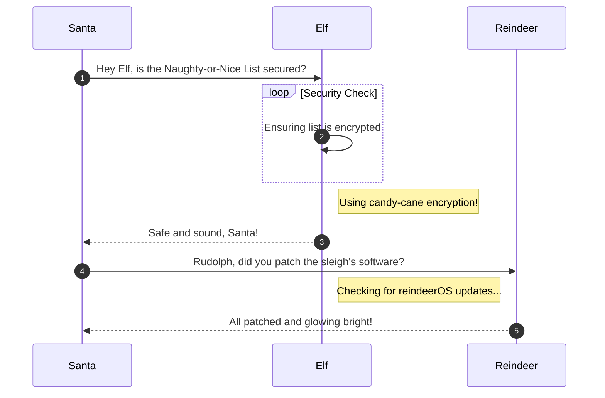

# Space Island Door Access Speaker

**Difficulty**: :fontawesome-solid-star::fontawesome-solid-star::fontawesome-solid-star::fontawesome-regular-star::fontawesome-regular-star:<br/>
**Direct link**: [Objective URL](https://.../)

## Objective

!!! question "Request"
    There's a door that needs opening on Space Island! Talk to Jewel Loggins there for more information.

??? quote "Jewel Loggins"
    What are you doing here, and who are you?<br/>
    Me first? I'm Jewel Loggins. And I was trekking through the jungle and happened to find this place.<br/>
    I liked this spot and decided to set up camp. Seeing you here is quite the surprise.<br/>
    Well, because the only other person I've ever seen come here is Wombley Cube.<br/>
    I thought this tram station in the middle of the jungle was strange to begin with, but then Wombley added to the intrigue.<br/>
    I guess all this spy stuff is typical for him, so maybe I shouldn't think much of it. I'm sure everything's fine.<br/>
    Every time he comes here, he says something to the speaker. Then, the door opens, and he rides the tram somewhere.<br/>
    I gave it a try, but the door didn't open for me. Knowing Wombley, it's some kind of secret passphrase.<br/>
    If you wanna see where the tram goes, I think you need to find out what that passphrase is.<br/>
    Ribb Bonbowford over at Coggoggle Marina on Steampunk Island works with Wombley. Try asking if he knows.<br/>
    I hope you find it. I'll be here when you get back!

## Hints

??? tip "Insert Hint 1 Title"
    Along the way you will receive different hints. Insert them here.

??? tip "Insert Hint 2 Title"
    Along the way you will receive different hints. Insert them here.

## Solution

This section explains the different steps taken to solve the challenge. Try to find a good balance between providing sufficient detail and not overloading the reader with too much information. Use [admonitions](https://squidfunk.github.io/mkdocs-material/reference/admonitions/), [images](https://squidfunk.github.io/mkdocs-material/reference/images/), [diagrams](https://squidfunk.github.io/mkdocs-material/reference/diagrams/), [code blocks](https://squidfunk.github.io/mkdocs-material/reference/code-blocks/), and [tables](https://squidfunk.github.io/mkdocs-material/reference/data-tables/) to highlight and structure important information or provide additional clarification.

### Admonitions

!!! warning "Anchor the decorations"
    Ensure that all festive decorations, especially electrical ones, are securely anchored. We don’t want them floating off into the tropical sunset!

!!! info "Palm tree lighting"
    While on the island, make sure to hang your Christmas lights on a palm tree. It’s not only festive but also a great beacon for Santa to find you!

### Images


### Diagrams



### Code blocks

```bash linenums="1" hl_lines="7" title="Countdown script (with line 7 highlighted)"
#!/bin/bash
echo "Christmas Holiday Countdown"

days_until_xmas=$(($(date -d "Dec 25" +%j) - $(date +%j)))

if [ $days_until_xmas -ge 0 ]; then
  echo "Only $days_until_xmas days until Christmas!"
else
  echo "Christmas has passed! Hope you had a great time!"
fi
```

### Tables

| Activity             | Santa's Verdict       | Elf Comments                    |
| :------------------- | :-------------------- | :------------------------------ |
| Iceberg Surfing      | Risky Business        | "Lost three surfboards!"        |
| Polar Bear Hugs      | Approach with Caution | "Fluffy but... brisk."          |
| Snow Fort Building   | Highly Recommended    | "Elf-sized doorways only."      |
| Aurora Light Chasing | Magical Experience    | "Better than Christmas lights!" |
| Penguin Parade       | Absolute Must-See     | "They're oddly organized!"      |

!!! success "Answer"
    Insert the answer to the objective here.

## Response

!!! quote "Jewel Loggins"
    What, you know the passphrase!? Let me try it!<Br/>
    Nope, didn't work. Knowing Wombley, the passphrase isn't the only requirement. He's all about that MFA!<Br/>
    Oh yeah, multi-factor authentication! The passphrase for something he knows, and his voice for something he is!<Br/>
    That's it! You need to be Wombley. You need his voice. Now, how are you gonna get that?<Br/>
    Since only us elves can get a subscription to use ChatNPT, try searching for another AI tool that can simulate voices. I'm sure there's one out there.
