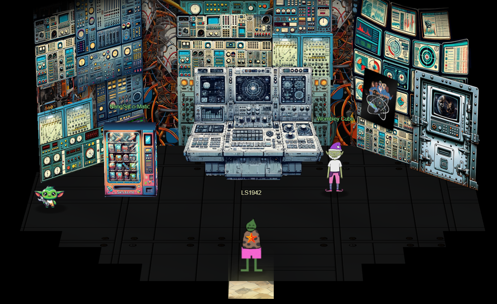
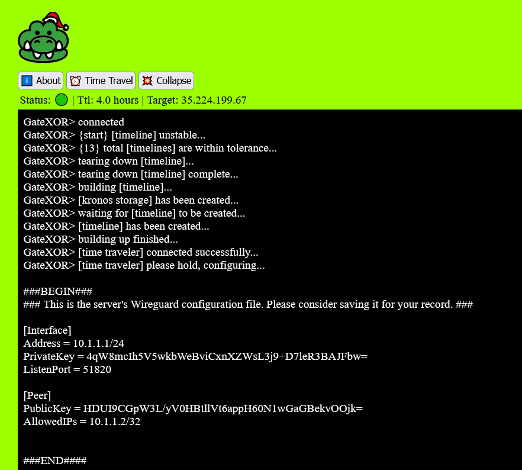
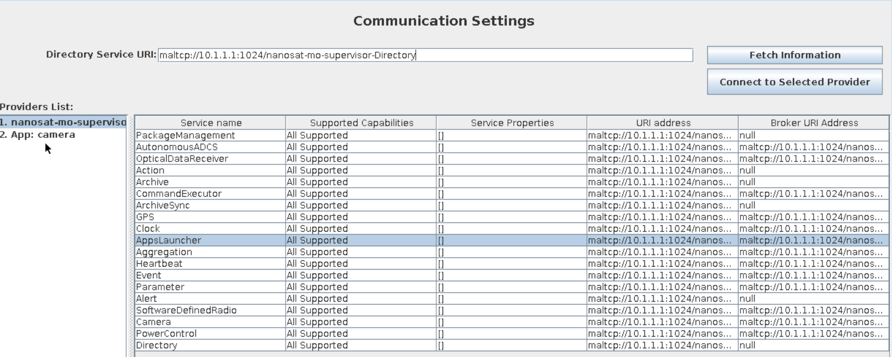
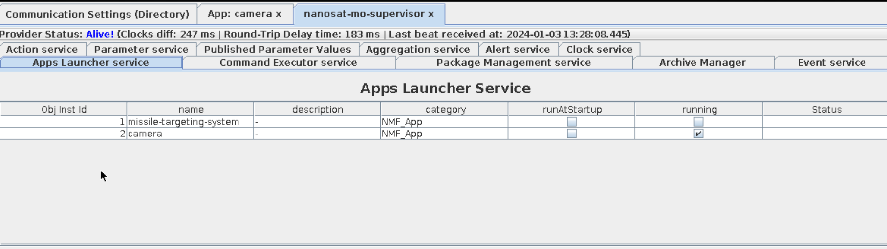
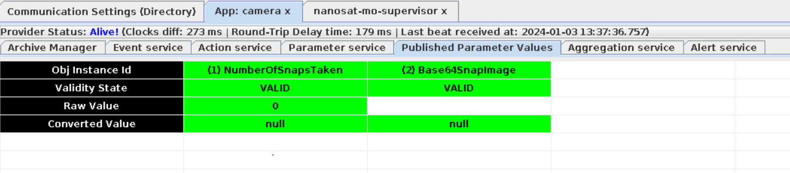
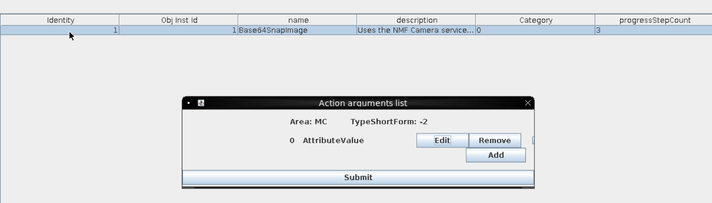
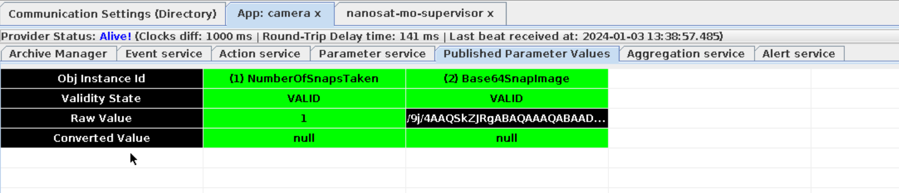
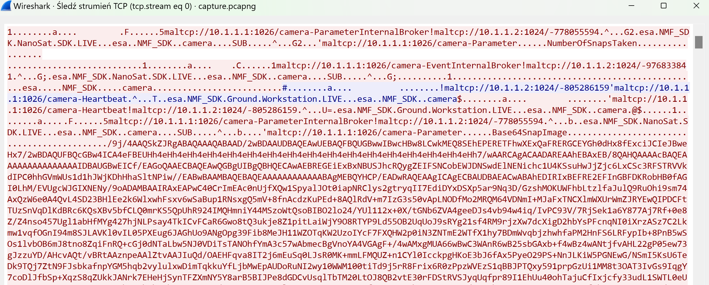
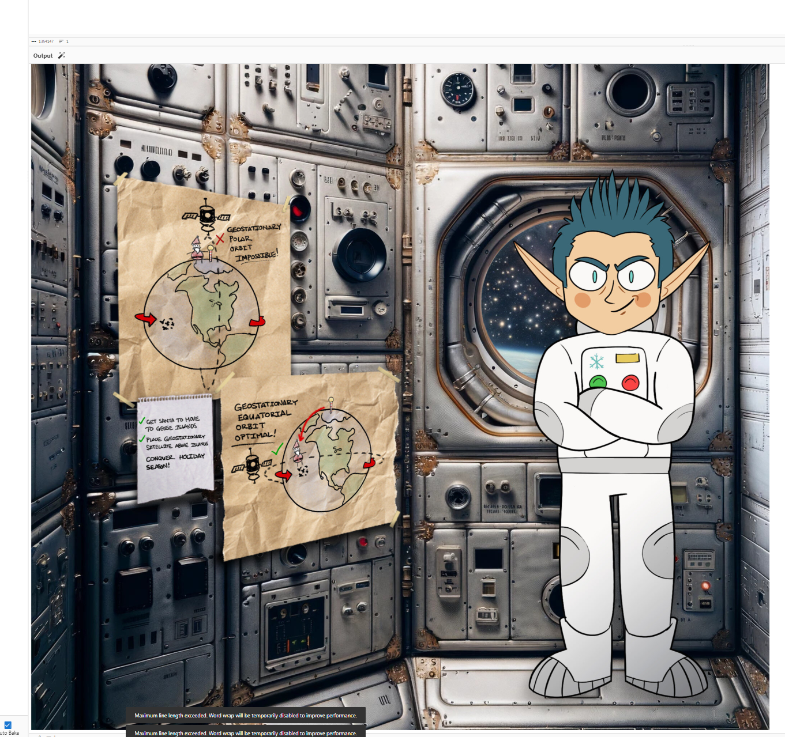

# Camera Access

**Difficulty**: :fontawesome-solid-star::fontawesome-solid-star::fontawesome-solid-star::fontawesome-regular-star::fontawesome-regular-star:<br/>
**Direct link**: [Objective URL](https://nanosat.one)

## Objective

!!! question "Request"
    Gain access to Jack's camera. What's the third item on Jack's TODO list?

??? quote "Wombley Cube"
    This is Ground Control, do you read me...? Ground Control to -- <br/>
    Hey! How'd you get in here? That tram is the only accessible point of entry and I secured it with MFA!<br/>
    No matter, you may have had the skills to find and infiltrate the satellite ground station, but there's no chance you can hack your way into the satellite itself!<br/>
    The nanosat's Supervisor Directory will remain hidden, and you'll never discover the mastermind behind all this.<br/>
    So don't even waste your time trying.<br/>

## Hints

??? tip "Hubris is a Virtue"
    In his hubris, Wombley revealed that he thinks you won't be able to access the satellite's "Supervisor Directory". There must be a good reason he mentioned that specifically, and a way to access it. He also said there's someone else masterminding the whole plot. There must be a way to discover who that is using the nanosat.


## Solution

We are situated in SGS Station. To kick off we need to grab container image which can be downloaded using vending machine called NanoSat-o-Matic.



We have quite many options to try and complete this task. We will kick-off with GateXOR terminal which needs to be started.



In This task we also need to connect our docker image using wireguard.
```sh
docker build -t nmf_client .
docker run -it --cap-add=NET_ADMIN -p 5900:5900 -p 6901:6901 --rm nmf_client
docker ps
docker exec -it d51cab512cd2 /bin/bash
vi /etc/wireguard/wg0.conf
wg-quick down wg0
wg-quick up wg0
```
Now we can open CTT Consumer Test Tool and interact with camera. First we interact with maltcp://10.1.1.1:1024/nanosat-mo-supervisor-Directory to see available Services.



We can see interesting app Camera, so let's enable it using terminal app.






One method is to getValue and intercept data using wireshark and then transfer it from container. We can see on screen that after running submitAction under Action service , values are populated and data is encrypted:







Second method way easier is to download it using CLI tool. (Credit to DeepPurple)
```
./cli-tool.sh parameter get -r maltcp://10.1.1.1:1024/nanosat-mo-supervisor-Directory -p "App: camera" image.jpg Base64SnapImage
```

OUTPUT:
```
root@156f7a91c502:/opt/nmf/cli-tool# ./cli-tool.sh parameter get -r maltcp://10.1.1.1:1024/nanosat-mo-supervisor-Directory -p "App: camera" image.jpg Base64SnapImage
2024-01-03 13:41:45.238 esa.mo.helpertools.helpers.HelperMisc loadProperties
INFO: Loading properties file:/opt/nmf/cli-tool/provider.properties
2024-01-03 13:41:45.542 esa.mo.helpertools.helpers.HelperMisc loadProperties
INFO: Loading properties file:/opt/nmf/cli-tool/settings.properties
2024-01-03 13:41:45.564 esa.mo.helpertools.helpers.HelperMisc loadProperties
INFO: Loading properties file:/opt/nmf/cli-tool/transport.properties
2024-01-03 13:41:45.937 esa.mo.helpertools.helpers.HelperMisc loadProperties
INFO: Loading properties file:/opt/nmf/cli-tool/consumer.properties
2024-01-03 13:41:46.594 org.ccsds.moims.mo.mal.transport.MALTransportFactory newFactory
INFO: New transport factory registered with classname: esa.mo.mal.transport.tcpip.TCPIPTransportFactoryImpl
2024-01-03 13:41:46.665 org.ccsds.moims.mo.mal.encoding.MALElementStreamFactory newFactory
INFO: New encoding factory registered with classname: esa.mo.mal.encoder.binary.fixed.FixedBinaryStreamFactory
2024-01-03 13:41:46.777 esa.mo.mal.transport.tcpip.TCPIPTransport createTransportAddress
INFO: TCP/IP Transport address: 10.1.1.2:1025
2024-01-03 13:41:46.867 esa.mo.mal.transport.gen.GENTransport manageCommunicationChannel
INFO: Establishing connection to remote root URI: maltcp://10.1.1.1:1024
2024-01-03 13:41:46.886 esa.mo.mal.transport.tcpip.TCPIPConnectionPoolManager get
INFO: The socket doesn't exist! Creating a new one...
2024-01-03 13:41:49.972 esa.mo.helpertools.helpers.HelperMisc loadProperties
INFO: Reloading properties file:/opt/nmf/cli-tool/consumer.properties


2024-01-03 13:41:50.083 esa.mo.mal.transport.gen.GENTransport manageCommunicationChannel
INFO: Establishing connection to remote root URI: maltcp://10.1.1.1:1025
2024-01-03 13:41:50.087 esa.mo.mal.transport.tcpip.TCPIPConnectionPoolManager get
INFO: The socket doesn't exist! Creating a new one...

Parameters successfully dumped to file: image.jpg

Consumer successfully closed.
```

Simple check of file structure reveled  encrypted data starting with Base64SnapImage. Data is added every 10 secs.
```
Domain: esa.NMF_SDK.camera
Base64SnapImage	1704289056097000000	
Base64SnapImage	1704289056098000000	
Base64SnapImage	1704289066098000000	
Base64SnapImage	1704289076099000000	
Base64SnapImage	1704289086098000000	
Base64SnapImage	1704289096098000000	
Base64SnapImage	1704289106098000000	
Base64SnapImage	1704289116098000000	
Base64SnapImage	1704289126098000000	
Base64SnapImage	1704289136098000000	/9j/4AAQSkZJRgABAQAAAQABAAD/<REMOVED>
```
Our image with answer:




!!! success "Answer"
    Conquer Holiday Season!

## Response

!!! quote "Wombley Cube"
    A fellow sabateur, are you? Or just a misguided hero-wannabe?<br/>
    You think you're saving the holiday season, but you're meddling in something you could never understand!<br/>
    Yes, I sided with Jack, because Santa's betrayed the elves by forcing us to move our operations to these islands!<br/>
    He put the entire holiday season at risk, and I could not allow this, I had to do something.<br/>
    Knowing my skillset, Jack secretly informed me of his plan to show Santa the error of his ways, and recruited me to aid his mission.<br/>
    Why tell you all this? Because it won't change anything. Everything is already in motion, and you're too late.<br/>
    Plus, the satellite is state-of-the-art, and -- oh drat, did I leave the admin tools open?<br/>
    For some reason, I can't move when you're nearby, but if I could, I would surely stop you!<br/>
