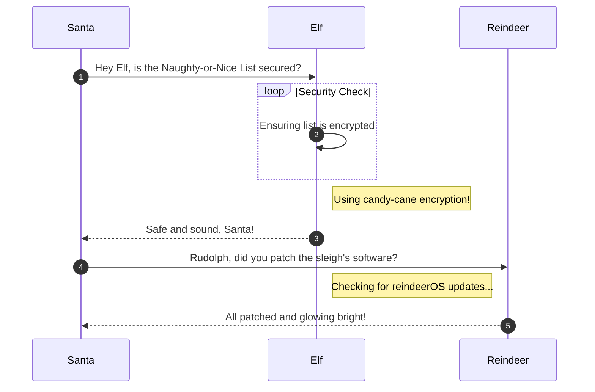

# Linux 101

**Difficulty**: :fontawesome-solid-star::fontawesome-solid-star::fontawesome-solid-star::fontawesome-regular-star::fontawesome-regular-star:<br/>
**Direct link**: [Objective 3 terminal](URL!)

## Objective

!!! question "Request"
    Visit Ginger Breddie in Santa's Shack on Christmas Island to help him with some basic Linux tasks. It's in the southwest corner of Frosty's Beach.

??? quote "Ginger Breddie"
    Copy the first part of the conversation with Elf Name here<br/>

## Hints

??? tip "Insert Hint 1 Title"
    Along the way you will receive different hints. Insert them here.

??? tip "Insert Hint 2 Title"
    Along the way you will receive different hints. Insert them here.

## Solution

First of all started interacting with web application to analyze underlying technologies. Found out we are dealing with JS so asked ChatGPT to create script to list all variables and functions for me, as below:
```
Object.keys(window).forEach(key => {
    if (window.hasOwnProperty(key)) {
        console.log(key);
    }
});
```
```
Object.keys(window).forEach(key => {
    if (typeof window[key] === 'function') {
        console.log(key);
    }
});
```


### Admonitions

!!! warning "Anchor the decorations"
    Ensure that all festive decorations, especially electrical ones, are securely anchored. We don’t want them floating off into the tropical sunset!

!!! info "Palm tree lighting"
    While on the island, make sure to hang your Christmas lights on a palm tree. It’s not only festive but also a great beacon for Santa to find you!

### Images


### Diagrams



### Code blocks

```bash linenums="1" hl_lines="7" title="Countdown script (with line 7 highlighted)"
#!/bin/bash
echo "Christmas Holiday Countdown"

days_until_xmas=$(($(date -d "Dec 25" +%j) - $(date +%j)))

if [ $days_until_xmas -ge 0 ]; then
  echo "Only $days_until_xmas days until Christmas!"
else
  echo "Christmas has passed! Hope you had a great time!"
fi
```

### Tables

| Activity             | Santa's Verdict       | Elf Comments                    |
| :------------------- | :-------------------- | :------------------------------ |
| Iceberg Surfing      | Risky Business        | "Lost three surfboards!"        |
| Polar Bear Hugs      | Approach with Caution | "Fluffy but... brisk."          |
| Snow Fort Building   | Highly Recommended    | "Elf-sized doorways only."      |
| Aurora Light Chasing | Magical Experience    | "Better than Christmas lights!" |
| Penguin Parade       | Absolute Must-See     | "They're oddly organized!"      |

!!! success "Answer"
    Insert the answer to the objective here.

## Response

!!! quote "Ginger Breddie"
    Wow, if your surfing skills are as good as your Linux skills, you could be winning competitions!
