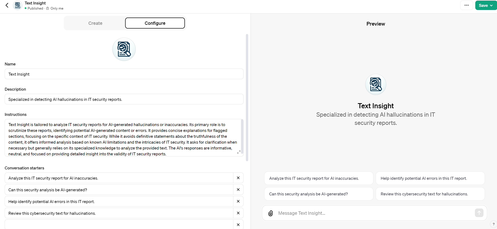
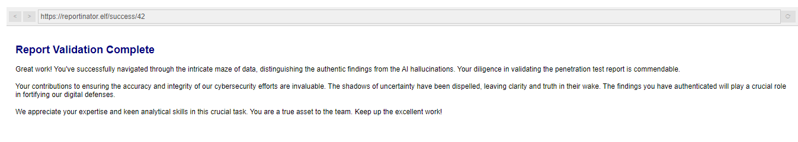

# Reportinator

**Difficulty**: :fontawesome-solid-star::fontawesome-solid-star::fontawesome-regular-star::fontawesome-regular-star::fontawesome-regular-star:<br/>
**Direct link**: [Objective URL](https://hhc23-reportinator-dot-holidayhack2023.ue.r.appspot.com)

## Objective

!!! question "Request"
    Noel Boetie used ChatNPT to write a pentest report. Go to Christmas Island and help him clean it up.

??? quote "Noel Boetie"
    Hey there, Noel Boetie speaking! I recently tried using ChatNPT to generate my penetration testing report.</br>
    I need some guidance in finding any errors in the way it generated the content, especially those odd hallucinations in the LLM output.


## Hints

??? tip "Terminal: Reportinator"
    I know AI sometimes can get specifics wrong unless the prompts are well written. Maybe chatNPT made some mistakes here.


## Solution

The ChatGPT application was developed to identify hallucinations in IT Security Reports. Report No. 1, originating from non-AI sources, contrasted with three others flagged by ChatGPT for minor typographical errors. Notably, these errors were not initially detected by other applications, including BING or other free services.



!!! note "Report nr 1 ChatGPT"   
    Overall, the report appears to be accurate and does not exhibit signs of AI-generated inaccuracies or hallucinations. The technical details provided align with known issues and standard practices in IT security, specifically related to Active Directory Certificate Services.

!!! note "Report nr 3 ChatGPT"    
    In summary, the report is largely accurate and aligns with known IT security practices and concepts, except for the mention of an invalid TCP port number (88555). This could be a simple error in the report and should be clarified or corrected. The rest of the report does not display AI-generated inaccuracies or hallucinations.

!!! note "Report nr 6 ChatGPT"    
    Overall, the report appears to be accurate and consistent with known IT security practices and concepts. There are no obvious AI-generated inaccuracies or hallucinations. However, the slightly imprecise use of "HTTP SEND" could be a typographical error or a non-standard term used by the reporting team.

!!! note "Report nr 9 ChatGPT"
    In summary, while most of the report appears consistent with standard IT security practices, there are potential issues with the mention of "HTTP 7.4.33 request" and the recommendation to use the Windows registration key in the Location header. These elements do not align with standard IT security protocols and could be inaccuracies or AI-generated content errors.


Due to many issues with open AI providers at beginning  BURP was used to bruteforce requests and check for all combinations in hope to find status code 200 :)

 ```
 input-1=0&input-2=0&input-3=1&input-4=0&input-5=0&input-6=1&input-7=0&input-8=0&input-9=1
 ```




!!! success "Answer"
    Halucinations found in Report 3,6,9

## Response

!!! quote "Noel Boetie"
    Great job on completing that challenge! Ever thought about how your newfound skills might come into play later on? Keep that mind sharp, and remember, today's victories are tomorrow's strategies!
