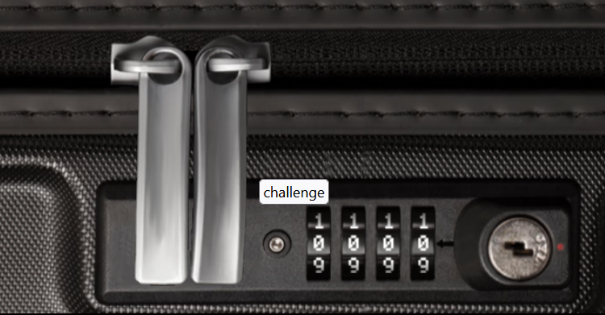

# Luggage Lock

**Difficulty**: :fontawesome-solid-star::fontawesome-regular-star::fontawesome-regular-star::fontawesome-regular-star::fontawesome-regular-star:<br/>
**Direct link**: [Objective 6 URL](https://lockdecode.com/)

## Objective

!!! question "Request"
    Help Garland Candlesticks on the Island of Misfit Toys get back into his luggage by finding the correct position for all four dials

??? quote "Garland Candlesticks"
    Hey there, I'm Garland Candlesticks! I could really use your help with something.<br/>
    You see, I have this important pamphlet in my luggage, but I just can't remember the combination to open it!

## Hints

??? tip "Chris Elgee's talk"
    Check out Chris Elgee's talk regarding his and his wife's luggage. Sounds weird but interesting!</br>
    https://youtu.be/ycM1hBSEyog


## Solution

Upon reviewing the instructional material provided by Chris's video, our initial approach started with rotating numbers on first poistion. After putting pressure on open button we are looking for resistance in rotation. Whenever we find resistance on given number we continute adding pressure and hoping onto next position to find opening combination. We should also listen carefully to sounds which might help us finding right combination.

Once we inspected web application we were able to  spot WebSocket communication as well.

```
42["message",{"Type":"Open","Combo":"7371"}]

After finding special combination we received WS message from server as below:

42["message",{"Type":"Open","Success":"True","Token":{"hash":"63867c655eaa6469bb28a62688c4e1b7ec0c435ef8ee67d9cf24cac953b8148d","resourceId":"5353ac49-2534-4de6-b8ed-9ef09dd76289"},"PlayerId":"5353ac49-2534-4de6-b8ed-9ef09dd76289"}]
```


### Images
{ width="500" }

{ width="500" }


## Response

!!! success "Answer"
    42["message",{"Type":"Open","Success":"True","Token":{"hash":"63867c655eaa6469bb28a62688c4e1b7ec0c435ef8ee67d9cf24cac953b8148d","resourceId":"5353ac49-2534-4de6-b8ed-9ef09dd76289"},"PlayerId":"5353ac49-2534-4de6-b8ed-9ef09dd76289"}]

!!! quote "Garland Candlesticks"
    Wow, you did it! I knew you could crack the code. Thank you so much!
