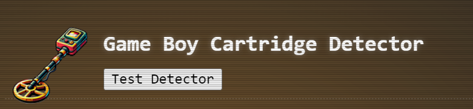
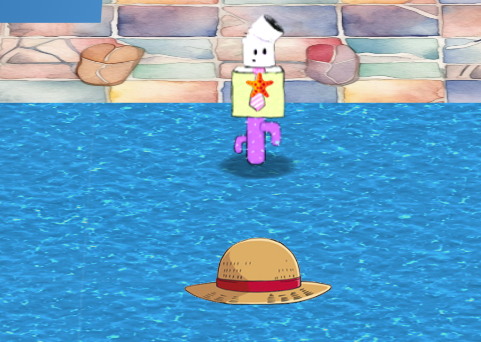
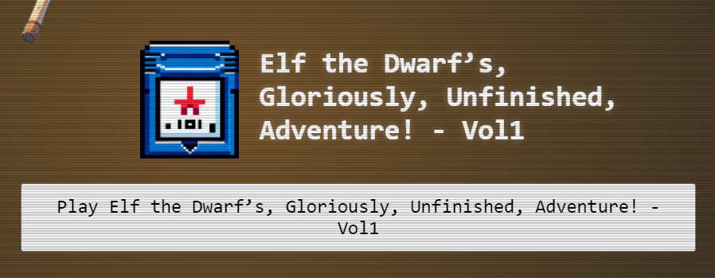
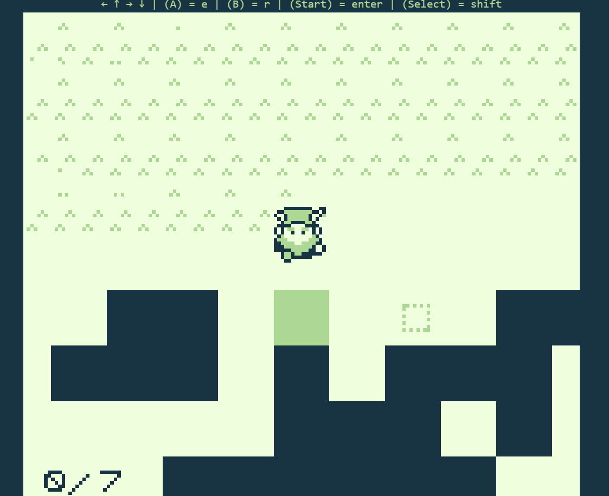
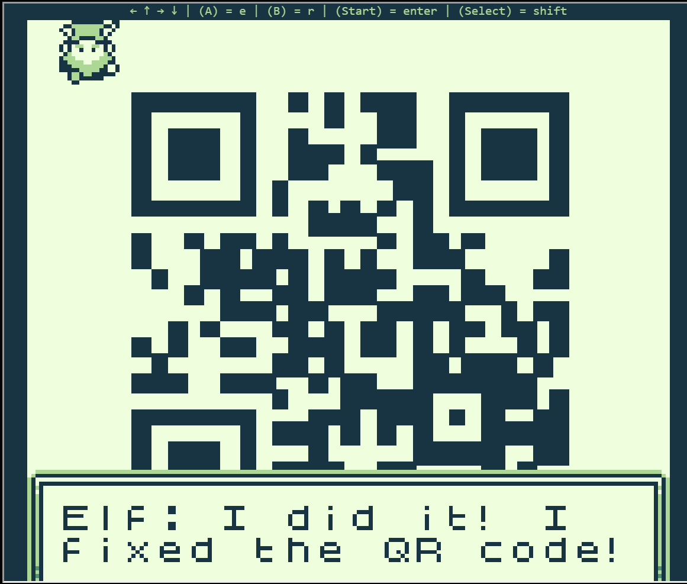

# Insert Game Cartridges: Vol 1

**Difficulty**: :fontawesome-solid-star::fontawesome-regular-star::fontawesome-regular-star::fontawesome-regular-star::fontawesome-regular-star: 
**Direct link**: [Objective 8 Terminal](https://gamegosling.com/vol1-uWn1t6xv4VKPZ6FN)

## Objective

!!! question "Request"
    Find the first Gamegosling cartridge and beat the game

??? quote "Dusty Giftwrap"
    The name's Angel Candysalt, the great treasure hunter! 
    A euphemism? No, why do people always ask me that?? 
    Anyways, I came here to nab the treasure hidden in this ship graveyard, only to discover it's protected by this rusted maze. 
    That must be why all these old ships are here. Their crew came to find the treasure, only to get lost in the labrynth.

## Hints

??? tip "Buried Treasures"
    There are 3 buried treasures in total, each in its own uncharted area around Geese Islands. Use the gameboy cartridge detector and listen for the sound it makes when treasure is nearby, which gets louder the closer you are. Also look for some kind of distinguishing mark or feature, which could mark the treasure's location.

??? tip "Gameboy1"
    Giving things a little push never hurts. 2) Out of sight but not out of ear-shot 3) You think you fixed the QR code? Did you scan it and see where it leads?

## Solution

First of all we have been equiped with Game Boy Cartridge Detector which was helping us out on finding locations of gameboy cartridges.

{ width="500" }

We found first cartridge on Tarnished Trove, Island of Misfit Toys.

{ width="500" }

Game was accessible from Items menu after clicking on avatar. 

{ width="500" }

Using arrow keys we had to move hidden boxes into highligted spots to fix QR Code. To be able to spot moveable object we had to shoot using music.

{ width="500" }

Once we moved all 7 boxes we have succesully completed a game. One of the boxes were a bit far away compared to the rest.

{ width="500" }

## Response

!!! quote "Dusty Giftwrap"
    Whoa, you found it! 
    It's a... video game cartridge? Coooooollll... I mean, arrrrrr....
