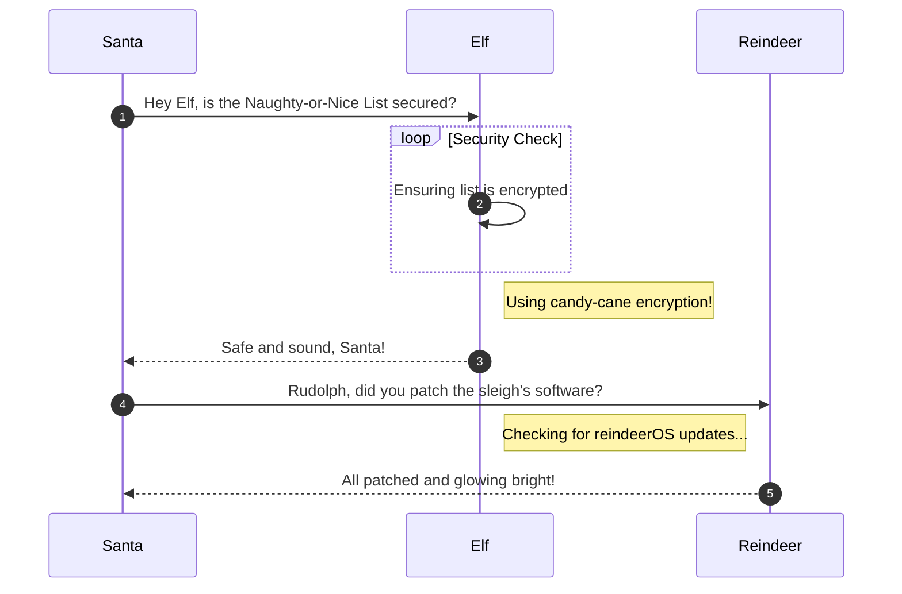

# Insert Objective 6 Title

**Difficulty**: :fontawesome-solid-star::fontawesome-solid-star::fontawesome-solid-star::fontawesome-solid-star::fontawesome-solid-star:<br/>
**Direct link**: [Objective6.zip](https://.../)

## Objective

!!! question "Request"
    Insert the objective description from your badge.

??? quote "Rose Mold"
    What am I doing in this saloon? The better question is: what planet are you from?<br/>
    Yes, I’m a troll from the Planet Frost. I decided to stay on Earth after Holiday Hack 2021 and live among the elves because I made such dear friends here.

## Hints

??? tip "Linux Privilege Escalation Techniques"
    There's various ways to escalate privileges on a Linux system.https://payatu.com/blog/a-guide-to-linux-privilege-escalation/

??? tip "Linux Command Injection"
    Use the privileged binary to overwriting a file to escalate privileges could be a solution, but there's an easier method if you pass it a crafty argument..

## Solution

After grabbing console access to terminal we started exploring interesting files on filesystem

```
find / -perm -u+s 2>/dev/null
```

### Admonitions

!!! warning "Anchor the decorations"
    Ensure that all festive decorations, especially electrical ones, are securely anchored. We don’t want them floating off into the tropical sunset!

!!! info "Palm tree lighting"
    While on the island, make sure to hang your Christmas lights on a palm tree. It’s not only festive but also a great beacon for Santa to find you!

### Images


### Diagrams



### Code blocks

```bash linenums="1" hl_lines="7" title="Countdown script (with line 7 highlighted)"
#!/bin/bash
echo "Christmas Holiday Countdown"

days_until_xmas=$(($(date -d "Dec 25" +%j) - $(date +%j)))

if [ $days_until_xmas -ge 0 ]; then
  echo "Only $days_until_xmas days until Christmas!"
else
  echo "Christmas has passed! Hope you had a great time!"
fi
```

### Tables

| Activity             | Santa's Verdict       | Elf Comments                    |
| :------------------- | :-------------------- | :------------------------------ |
| Iceberg Surfing      | Risky Business        | "Lost three surfboards!"        |
| Polar Bear Hugs      | Approach with Caution | "Fluffy but... brisk."          |
| Snow Fort Building   | Highly Recommended    | "Elf-sized doorways only."      |
| Aurora Light Chasing | Magical Experience    | "Better than Christmas lights!" |
| Penguin Parade       | Absolute Must-See     | "They're oddly organized!"      |

!!! success "Answer"
    Insert the answer to the objective here.

## Response

!!! quote "Insert Elf Name"
    Copy the final part of the conversation with Elf Name here.
