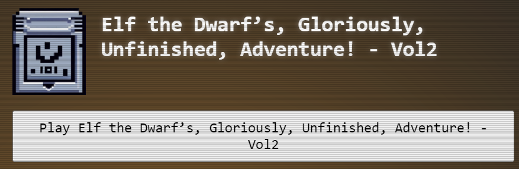
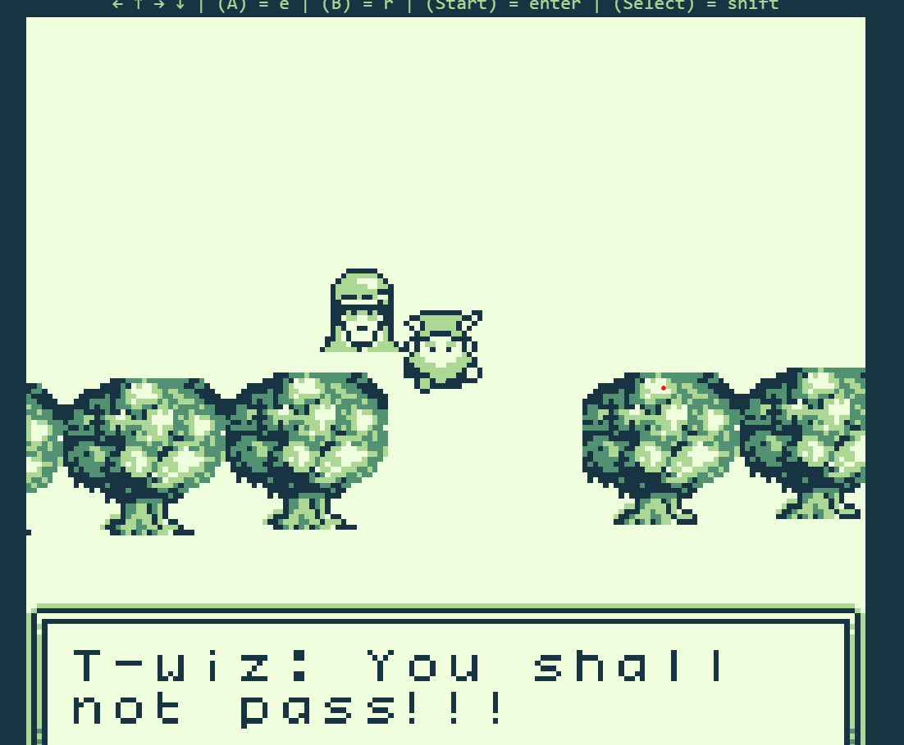
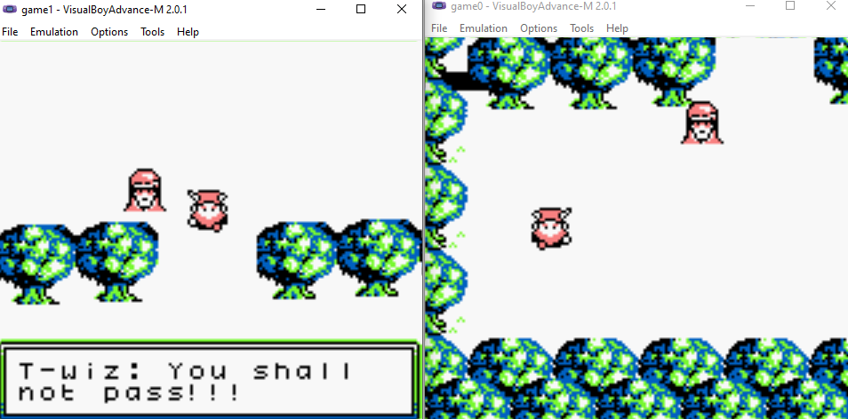
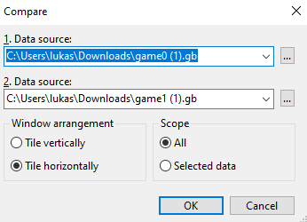
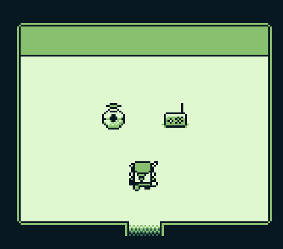

# Insert Game Cartridges: Vol 2

**Difficulty**: :fontawesome-solid-star::fontawesome-solid-star::fontawesome-solid-star::fontawesome-regular-star::fontawesome-regular-star:<br/>
**Direct link**: [Objective Game0.gb](https://gamegosling.com/vol2-akHB27gg6pN0/rom/game0.gb)

## Objective

!!! question "Request"
    Find the second Gamegosling cartridge and beat the game

??? quote "Tinsel Upatree"
    I can't believe I was actually able to find this underground cavern!<br/>
    I discovered what looked liike an old pirate map in the attic of one of those huts in Rainraster Cliffs, and it actually led somewhere!<br/>
    But now that I've seen where it leads, I think this might've been a bad idea. This place is scary! Maybe you want to take it from here?


## Hints

??? tip "Gameboy 2"
    1) This feels the same, but different! 2) If it feels like you are going crazy, you probably are! Or maybe, just maybe, you've not yet figured out where the hidden ROM is hiding. 3) I think I may need to get a DIFFerent perspective. 4) I wonder if someone can give me a few pointers to swap.

??? tip "Gameboy 2"
    Try poking around Pixel Island. There really aren't many places you can go here, so try stepping everywhere and see what you get!

## Solution

We have been informed that two versions of the game are available, and the game can also be accessed through a badge.

??? tip "Tip"
    Tinsel Upatree: Did you know that many games had multiple versions released? Word is: volume 2 has 2 versions!

{ width="500" }


Once we started playing game we found a place where we couldn't pass and T-wiz force was not letting us through!


{ width="500" }

Quickly looking into Network console we found a gameboy ROM which could be downloaded. 

https://gamegosling.com/vol2-akHB27gg6pN0/rom/game0.gb 

There was mentioned second version under same URL with game1.gb name.

https://gamegosling.com/vol2-akHB27gg6pN0/rom/game1.gb

AS next step we loaded both GB files using Game Boy Advance emulator. We can see each version of the game situate us on different location.

{ width="500" }

To look deeper into the GB features we inspected images using Hex editor "HxD Hex Editor.exe"

{ width="500" }

To also make it more visible we can use XXD and diff linux tools to find 
```
lukasz@DESKTOP-4DU5JIH:/mnt/d/code/gb$ xxd game1.gb >1
lukasz@DESKTOP-4DU5JIH:/mnt/d/code/gb$ diff 0 1
21c21
< 00000140: 0000 0000 3030 001b 0203 0033 0142 71b3  ....00.....3.Bq.
---
> 00000140: 0000 0000 3030 001b 0203 0033 0142 7186  ....00.....3.Bq.
90c90
< 00000590: 5405 050b 4b9a 2300 0000 0000 06ad 4210  T...K.#.......B.
---
> 00000590: 5405 05d2 ac3d 2d00 0000 0000 06ad 4210  T....=-.......B.
5801c5801
< 00016a80: 2080 0c80 0300 000f f807 0000 0000 0f10   ...............
---
> 00016a80: 2080 0c80 0b00 000f f807 0000 0000 0f10   ...............
5804c5804
< 00016ab0: 0000 0000 2000 0600 0900 000f f807 0000  .... ...........
---
> 00016ab0: 0000 0000 2000 0600 0600 000f f807 0000  .... ...........
6089c6089
< 00017c80: 0200 fe80 002a 0013 fffe fffb 13ff ffff  .....*..........
---
> 00017c80: 0100 fe80 002a 0013 fffe fffb 13ff ffff  .....*..........
6225,6226c6225,6226
< 00018500: 1204 2103 c60d 5701 1400 00ff fc14 0280  ..!...W.........
< 00018510: fffd 140b 80ff fe35 fffc 3200 fffc 2703  .......5..2...'.
---
> 00018500: 1204 2103 c60d 5701 1400 00ff fc14 0300  ..!...W.........
> 00018510: fffd 1404 00ff fe35 fffc 3200 fffc 2703  .......5..2...'.
```

Offset 18515 is interesting point where data manipulation gives us possiblity to spawn character in different location.

{ width="500" }

{ width="500" }

Here we need to enable sound and listen to radio transmission in morse code which translates to our answer GL0RY :)

```
MORSE CODE:
--. .-.. ----- .-. -.--
```


!!! success "Answer"
    GL0RY

## Response

!!! quote "Tinsel Upatree"
    At least it's obvious where this one is. See that shiny spot over to the right? That's gotta be where it is! If only I had a bird's eye view.<BR/>
    But how to get there? Up? Down? Left? Right? Oh well, that's your problem now!<BR/>
    Come back if you can find your way to it, and I'll tell you some secrets I've heard about this one.
